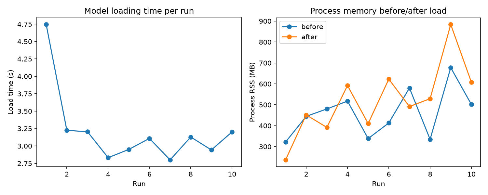
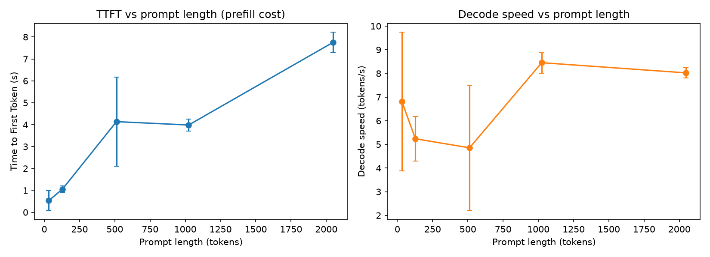
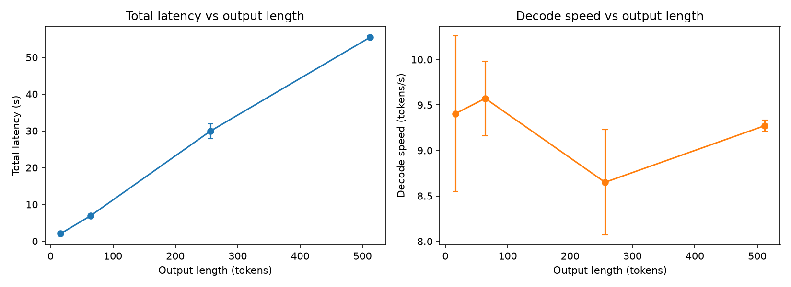

# Week 1 — Transformer Inference Fundamentals

**Phase I — Understand CPU Inference** (Weeks 1–3)

## 1. What question are we investigating?

What actually happens, performance-wise, when a Small Language Model runs inference on
a CPU using a standard Python/PyTorch stack — specifically, how do model loading,
prompt length (prefill), and output length (decode) each affect latency and throughput?

## 2. Why does the question matter?

Every later week in this program builds on this baseline: llama.cpp comparisons (Week
2), thread/context scaling (Week 3), and quantization tradeoffs (Weeks 4–5) all need a
correct mental model of *why* prefill and decode behave differently before their
optimization can be understood.

## 3. What is the hypothesis?

See [`hypothesis.md`](hypothesis.md). Summary: prefill cost scales with prompt length;
decode cost per token is roughly constant regardless of prompt length; therefore total
latency for a fixed prompt scales roughly linearly with output length.

## 4. What is the experimental setup?

- **Model:** [`Qwen/Qwen2.5-1.5B-Instruct`](https://huggingface.co/Qwen/Qwen2.5-1.5B-Instruct)
  (1.5B parameters, fp32, run via Hugging Face Transformers).
- **Hardware:** Apple M4, 10 physical / 10 logical cores, macOS 15.7 (arm64).
- **Inference:** CPU only (`torch.device("cpu")`), greedy decoding (temperature 0,
  argmax), `torch.set_num_threads` pinned to the physical core count (10) — see
  [§9 Limitations](#9-what-are-the-limitations) for why this matters.
- **Generation loop:** a manual, token-by-token loop (`common.py::generate_with_timing`)
  rather than `model.generate()`, so the timing boundary between the prefill forward
  pass (produces the first token) and each subsequent one-token decode step
  (using the KV cache) is explicit and precisely measurable.
- **Code:** [`scripts/common.py`](scripts/common.py) (shared loading/generation/timing),
  [`scripts/exp_1_1_loading_time.py`](scripts/exp_1_1_loading_time.py),
  [`scripts/exp_1_2_prompt_length.py`](scripts/exp_1_2_prompt_length.py),
  [`scripts/exp_1_3_output_length.py`](scripts/exp_1_3_output_length.py),
  [`analysis/analyze.py`](analysis/analyze.py).
- **Config:** [`config/model.yaml`](config/model.yaml).

To reproduce:

```bash
uv sync
uv run python experiments/01-inference-basics/scripts/exp_1_1_loading_time.py
uv run python experiments/01-inference-basics/scripts/exp_1_2_prompt_length.py
uv run python experiments/01-inference-basics/scripts/exp_1_3_output_length.py
uv run python experiments/01-inference-basics/analysis/analyze.py
```

## 5. What variables are controlled?

Model, hardware, thread count, dtype (fp32), decoding strategy (greedy), and — within
each experiment — everything except the one variable being swept.

## 6. What variables are changed?

- **Experiment 1.1:** nothing — the same load is repeated 10 times to observe run-to-run
  variance.
- **Experiment 1.2:** prompt length (32, 128, 512, 1024, ~2048 tokens), output length
  fixed at 64 tokens, 5 repetitions per prompt length.
- **Experiment 1.3:** output length (16, 64, 256, 512 tokens), prompt fixed, 5
  repetitions per output length.

## 7. What metrics are collected?

Load time, process RSS before/after loading, Time to First Token (TTFT, i.e. prefill
latency), decode time, decode speed (tokens/s), total latency, and full experiment
metadata (hardware/software/model/config) per `FULL-ROADMAP.md` §14 — see
`results/raw/01-inference-basics/exp_*_metadata.json`.

## 8. What are the results?

Raw data: `results/raw/01-inference-basics/`. Processed summaries:
`results/processed/01-inference-basics/`. Figures: `results/figures/01-inference-basics/`.

### 1.1 — Model Loading Time (n=10)

| | load_time_s | mem_before_mb | mem_after_mb | mem_delta_mb |
|---|---|---|---|---|
| mean | 3.21 | 461.0 | 521.7 | 60.7 |
| median | 3.12 | 462.4 | 510.3 | 73.1 |
| std | 0.56 | 115.1 | 173.2 | 121.2 |
| min | 2.80 | 321.9 | 236.5 | −88.7 |
| max | 4.74 | 677.5 | 883.8 | 209.4 |

The first run (4.74s) was visibly slower than every subsequent run (2.80–3.22s) — the
OS file cache is cold for the safetensors weight files on the first load and warm after.
Memory delta is noisy (see [§9](#9-what-are-the-limitations)).



### 1.2 — Prompt Length (output fixed at 64 tokens, n=5 per length)

| prompt tokens | TTFT mean (s) | TTFT std | decode tok/s mean | decode tok/s std |
|---|---|---|---|---|
| 32 | 0.53 | 0.45 | 6.81 | 2.93 |
| 128 | 1.05 | 0.15 | 5.24 | 0.94 |
| 512 | 4.14 | 2.02 | 4.86 | 2.65 |
| 1024 | 3.98 | 0.27 | 8.45 | 0.45 |
| 2048 | 7.75 | 0.46 | 8.02 | 0.22 |



### 1.3 — Output Length (prompt fixed, n=5 per length)

| output tokens | TTFT mean (s) | total latency mean (s) | decode tok/s mean | decode tok/s std |
|---|---|---|---|---|
| 16 | 0.44 | 2.05 | 9.40 | 0.85 |
| 64 | 0.30 | 6.89 | 9.57 | 0.41 |
| 256 | 0.32 | 29.91 | 8.65 | 0.58 |
| 512 | 0.31 | 55.42 | 9.27 | 0.06 |



## 9. How should the results be interpreted?

**Loading is fast and dominated by disk/cache state, not computation.** ~3.1s median to
load a 1.5B fp32 model (≈6GB of weights) from a warm cache is essentially I/O plus
Python/Transformers initialization overhead — there's no heavy compute in loading.

**TTFT grows with prompt length, confirming prefill scales with prompt size** (§8, Exp
1.2): 0.53s → 1.05s → ~4s → 7.75s as prompt length goes 32 → 128 → ~512–1024 → 2048
tokens. This is the clearest confirmation of the core hypothesis: prefill is one large
forward pass whose cost grows with how much prompt it has to process.

**Decode speed is roughly constant across prompt lengths, but noisier than expected at
short prompts.** At 1024 and 2048 tokens decode speed is tight and consistent (8.45 and
8.02 tok/s, std < 0.5). At 32, 128, and 512 tokens it is both lower on average and much
noisier (std up to 2.65 tok/s at 512). One plausible explanation: at short prompt
lengths the entire generation (prefill + 64 decode steps) finishes in a few seconds, so
transient OS scheduling noise or CPU frequency ramp-up is a *larger fraction* of a
*shorter* measurement window; at long prompt lengths the run takes long enough that
early transients get averaged out. This is an interpretation, not a proven mechanism —
see limitations below.

**Total latency scales close to linearly with output length** (§8, Exp 1.3): per-token
cost is ~0.108s/token at 512 and 256 tokens (55.42/512, 29.91/256), rising slightly to
~0.108–0.128s/token at 64 and 16 tokens — consistent with a small, fixed TTFT overhead
being a larger fraction of a very short generation. TTFT itself stays essentially flat
(0.30–0.44s) regardless of output length, exactly as expected: output length is decided
after prefill has already happened, so it cannot affect TTFT.

**Memory delta measurements from Experiment 1.1 are not reliable** — see limitations.

## 10. What are the limitations?

- **In-process repeated loading confounds the memory measurement.** Experiment 1.1
  reloads the model 10 times inside the same Python process (`del` + `gc.collect()`
  between runs) rather than in 10 fresh processes. CPython's allocator does not
  necessarily return freed memory to the OS immediately, so `mem_before`/`mem_after`
  RSS reflects allocator/OS paging behavior as much as it reflects the model's actual
  footprint — this is why `mem_delta_mb` ranges from −88.7 to +209.4 MB. A cleaner
  design would spawn one fresh subprocess per repetition.
- **Threads were pinned to the physical core count (10), not left at PyTorch's default
  (4) or swept as a variable.** This was a deliberate choice to get a representative
  baseline rather than an artificially thread-starved one, but it means this week's
  absolute numbers aren't comparable to a default PyTorch install. Thread count is the
  explicit subject of Week 3.
- **n=5 repetitions per condition in Experiments 1.2/1.3 is small.** It's enough to see
  the expected trend and rule out gross violations of the hypothesis, but not enough for
  tight confidence intervals — the noise discussed in §9 for the 512-token prompt bucket
  in particular would benefit from more repetitions.
- **A single machine, single model, single quantization (fp32) was tested.** No claim
  here generalizes across hardware or model families yet — that's the point of later
  weeks (Week 3: hardware; Week 4–6: quantization and model comparison).
- **Prompt-length targeting is approximate.** `make_prompt_of_length` builds a prompt by
  token count, decodes it to text, then the experiment re-tokenizes that text — the
  actual prompt length fed to the model (recorded in `actual_prompt_tokens`) differs
  slightly from the target (e.g. 2048 target → 2020 actual) because decode→encode isn't
  perfectly invertible under BPE tokenization.

## 11. What new questions emerged?

- Is the decode-speed noise at short prompt lengths (§9) actually a CPU
  frequency-ramp/scheduling effect, or something else (e.g. memory allocator warm-up)?
  Worth a targeted follow-up with more repetitions and, ideally, `perf`/`powermetrics`
  correlation.
- How does this Python/Transformers baseline compare to llama.cpp on the same model and
  hardware? (Week 2, Experiment 2.1.)
- At what thread count does decode speed stop improving on this 10-core machine? (Week
  3, Experiment 3.1.)
- Does the roughly-linear total-latency-vs-output-length relationship hold at much
  longer output lengths (e.g. 2048+ tokens), or does something change (thermal
  throttling, memory pressure)? (Touches Week 3, Experiment 3.4.)

These are tracked, along with every other week's, in
[`docs/methodology/open-questions.md`](../../docs/methodology/open-questions.md).
