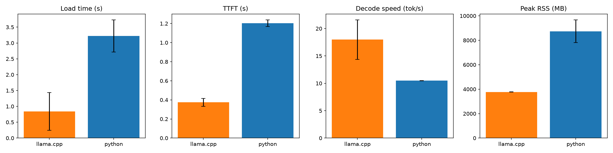
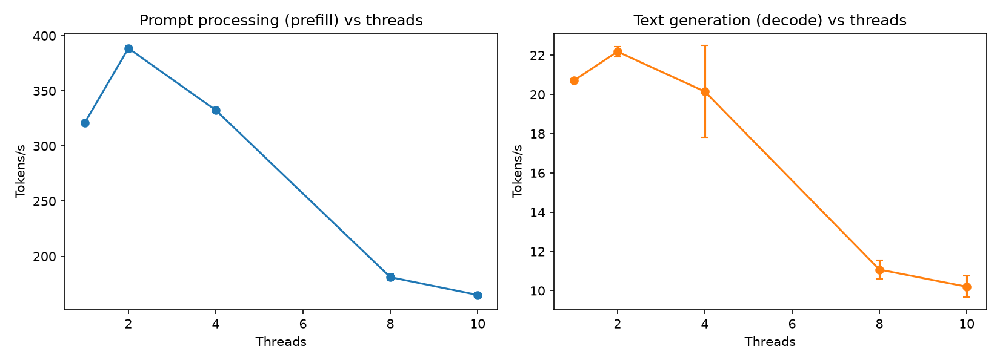
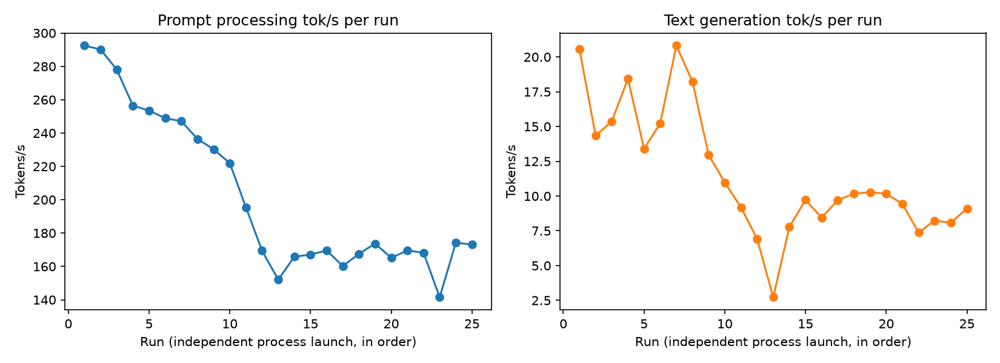

# Week 2 — llama.cpp and GGUF

**Phase I — Understand CPU Inference** (Weeks 1–3)

## 1. What question are we investigating?

How does a purpose-built CPU inference engine (llama.cpp, running a GGUF model)
compare to the general-purpose Python/Transformers baseline from Week 1 — in loading
time, memory, Time to First Token, and decode speed — and how does llama.cpp's own
performance scale with thread count and vary run-to-run?

## 2. Why does the question matter?

Week 1 established what prefill/decode look like in a naive Python implementation.
Before optimizing further (quantization in Weeks 4–5, a production Go service in Week
7+), we need to know how much of Week 1's performance ceiling was "CPU inference is
inherently this slow" versus "the framework we used has overhead a dedicated engine
doesn't." This week also produces the CPU-only build of llama.cpp that every later
week depends on.

## 3. What is the hypothesis?

See [`hypothesis.md`](hypothesis.md). Summary: llama.cpp should beat the Python
baseline on every metric (Exp 2.1); throughput should scale with threads up to some
point and then flatten or decline (Exp 2.2); and run-to-run variance should be small
and stable once the file cache is warm (Exp 2.3).

## 4. What is the experimental setup?

- **Model:** same as Week 1 — `Qwen/Qwen2.5-1.5B-Instruct` — but as the **F16 GGUF**
  published by Qwen (`Qwen/Qwen2.5-1.5B-Instruct-GGUF`,
  `qwen2.5-1.5b-instruct-fp16.gguf`), not a quantized format. F16 was chosen
  deliberately so this week isolates the *engine* variable; quantization is Weeks 4–5.
- **Engine:** llama.cpp built from source at commit `c92e806`
  ([`scripts/setup_llama_cpp.sh`](scripts/setup_llama_cpp.sh)), CPU-only — **Metal
  (GPU) explicitly disabled** at build time (`-DGGML_METAL=OFF`), Apple Accelerate
  BLAS kept enabled (`-DGGML_BLAS=ON`), matching Week 1's forced-CPU constraint.
- **Hardware:** same Apple M4, 10 physical/logical cores, macOS 15.7 (arm64), as Week 1.
- **Code:**
  [`scripts/llama_cpp_runner.py`](scripts/llama_cpp_runner.py) (subprocess + parsing
  helpers), [`scripts/exp_2_1_python_vs_llamacpp.py`](scripts/exp_2_1_python_vs_llamacpp.py),
  [`scripts/exp_2_2_thread_scaling.py`](scripts/exp_2_2_thread_scaling.py),
  [`scripts/exp_2_3_repeatability.py`](scripts/exp_2_3_repeatability.py),
  [`analysis/analyze.py`](analysis/analyze.py).
- **Config:** [`config/model.yaml`](config/model.yaml).

To reproduce from a clean checkout:

```bash
experiments/02-llama-cpp/scripts/setup_llama_cpp.sh     # clone + build llama.cpp (CPU-only)
experiments/02-llama-cpp/scripts/download_gguf.sh       # download the F16 GGUF
uv run python experiments/02-llama-cpp/scripts/exp_2_1_python_vs_llamacpp.py
uv run python experiments/02-llama-cpp/scripts/exp_2_2_thread_scaling.py
uv run python experiments/02-llama-cpp/scripts/exp_2_3_repeatability.py
uv run python experiments/02-llama-cpp/analysis/analyze.py
```

## 5. What variables are controlled?

Model identity, hardware, and — in Experiment 2.1 — thread count (10, matching Week
1's pinned physical-core count) and the effective prompt (see limitations: the Python
side now applies the same chat template llama-cli applies by default, so both engines
process an identical 56-token prompt).

## 6. What variables are changed?

- **Experiment 2.1:** engine (Python/Transformers vs llama.cpp), 10 repetitions each,
  each repetition a fresh OS process for both engines (fair peak-RSS comparison).
- **Experiment 2.2:** thread count (1, 2, 4, 8, 10), via llama-bench's native sweep,
  5 internal repetitions per thread count (default warmup enabled).
- **Experiment 2.3:** nothing swept — the identical benchmark (512-token prefill,
  128-token decode, 10 threads, `--no-warmup`) is executed 25 times as 25 independent
  process launches, to observe run-to-run variance and warm-up/thermal effects.

## 7. What metrics are collected?

Load time, Time to First Token (prefill), decode time and tokens/s, total time, peak
RSS — all via `/usr/bin/time -l` for peak memory and llama.cpp's own `--perf`
instrumentation for prefill/decode timing (see limitations for how load time is
derived). Experiments 2.2/2.3 use llama-bench's native pp/tg tokens/s measurements.

## 8. What are the results?

Raw: `results/raw/02-llama-cpp/`. Processed: `results/processed/02-llama-cpp/`.
Figures: `results/figures/02-llama-cpp/`.

### 2.1 — Python vs llama.cpp (n=10 each, 56-token prompt, 64 generated tokens, 10 threads)

| metric | llama.cpp | Python |
|---|---|---|
| load time (s) | 0.84 ± 0.59 | 3.22 ± 0.51 |
| TTFT (s) | 0.37 ± 0.04 | 1.20 ± 0.04 |
| decode speed (tok/s) | 17.98 ± 3.61 | 10.48 ± 0.03 |
| peak RSS (MB) | 3769 ± 7 | 8739 ± 936 |



### 2.2 — Thread Count (llama-bench, 512-token prefill / 128-token decode, n=5 internal reps)

| threads | prefill (pp) tok/s | decode (tg) tok/s |
|---|---|---|
| 1 | 321.0 ± 0.4 | 20.7 ± 0.1 |
| 2 | 388.5 ± 2.5 | 22.2 ± 0.3 |
| 4 | 332.5 ± 2.2 | 20.1 ± 2.3 |
| 8 | 181.1 ± 2.6 | 11.1 ± 0.5 |
| 10 | 164.9 ± 2.1 | 10.2 ± 0.5 |



### 2.3 — Repeatability (25 independent runs, 512-token prefill / 128-token decode, 10 threads, no internal warmup)

| test | mean tok/s | std | CV% | min | max | Pearson r vs run order |
|---|---|---|---|---|---|---|
| pp | 202.7 | 47.3 | 23.3% | 141.5 | 292.5 | −0.89 |
| tg | 11.5 | 4.5 | 39.4% | 2.7 | 20.8 | −0.71 |



## 9. How should the results be interpreted?

**llama.cpp wins decisively on every metric in Experiment 2.1**, confirming the
hypothesis: ~3.8x faster loading, ~3.2x faster TTFT, ~1.7x faster decode, and ~2.3x
lower peak memory than the Python/Transformers baseline for the same model. This is
the clearest result of the week and matches the mental model: a dedicated CPU
inference engine with optimized kernels and no framework overhead beats a
general-purpose eager-mode framework by a wide margin.

**Thread scaling does *not* look like the textbook diminishing-returns curve — it
peaks early and then actively regresses** (Experiment 2.2). Both prefill and decode
throughput peak at **2 threads** (388.5 pp tok/s, 22.2 tg tok/s), stay roughly flat
through 4 threads, then *drop sharply* at 8 and 10 threads — at 10 threads, prefill
throughput (164.9 tok/s) is barely half its peak value. The most likely explanation is
Apple M4's heterogeneous core design (a mix of performance and efficiency cores):
requesting 8 or 10 threads likely forces work onto slower efficiency cores and/or
introduces scheduling and thread-migration overhead that a small, all-performance-core
thread pool avoids. This is an interpretation, not a proven mechanism — Week 3
(CPU Performance Engineering) investigates physical vs logical cores directly and
should be able to confirm or refute it.

**Repeatability shows a strong, unexpected downward trend, not the small stable
variance the hypothesis predicted** (Experiment 2.3). Prefill throughput declines
almost monotonically from 292.5 tok/s (run 1) to a plateau around 165–175 tok/s by
roughly run 13, and stays there (Pearson r = −0.89 between run order and throughput).
Decode shows the same shape with more noise (r = −0.71). This is the opposite of a
"cold cache warms up and gets faster" effect — it looks much more like **thermal
throttling under sustained load**: 25 back-to-back benchmark runs at 10 threads (a
thread count Experiment 2.2 already showed is not even optimal on this chip) keep the
CPU busy for several minutes, and the observed decline-then-plateau shape is exactly
what you'd expect if clock speed steps down as the chip heats up and then stabilizes
at a sustained thermal limit. This directly anticipates Week 3 Experiment 3.4
(thermal effects) — this week produced an unplanned early signal of it.

## 10. What are the limitations?

- **Load time is derived, not directly measured, for llama.cpp.** This llama.cpp
  version doesn't print a single stable "model load time" log line, so
  `load_time_s = wall_clock_time − reported_total_inference_time`, which also folds in
  process startup and shutdown. Coarser than Week 1's direct Python measurement, but
  applied consistently across all Exp 2.1 llama.cpp runs.
- **Precision differs between engines (F16 llama.cpp vs fp32 Python), confounding the
  engine comparison with a numeric-precision comparison.** Week 1 used fp32 because
  Transformers' fp16 CPU kernels are poorly optimized; llama.cpp's GGUF is F16. Exp 2.1
  therefore isolates "engine + precision" together, not engine alone. Quantization's
  effect on speed/quality is the explicit subject of Weeks 4–5.
- **Python peak RSS grew across repetitions within Experiment 2.1** (from ~6.1GB on
  run 1 to ~9.2GB on later runs, driving the large std shown in the table/figure)
  despite each repetition being an independent OS process. The likely explanation is
  that Transformers' safetensors loading is memory-mapped, and the OS page cache for
  that file warms up across repeated loads, so more of the file shows as "resident"
  without the process doing more distinct work — but this wasn't directly verified.
- **The Experiment 2.2 thread-scaling explanation (P-core/E-core scheduling) is
  plausible but unconfirmed** — this week didn't instrument per-core utilization.
- **Experiment 2.3's thermal-throttling explanation is an interpretation, not a
  measurement** — no chip temperature or clock-speed data was collected, only
  throughput over time. The pattern is consistent with throttling but so are a couple
  of other explanations (e.g. progressive memory fragmentation); Week 3 should
  instrument this properly (e.g. `powermetrics`).
- **Single machine, single model, one non-optimal thread count for Exp 2.3** (10
  threads, chosen for continuity with Week 1/Exp 2.1, but Exp 2.2 shows this is
  actually the worst-performing configuration tested) — repeating Exp 2.3 at 2 threads
  would help separate "thermal effect" from "bad thread count" as contributing causes.

## 11. What new questions emerged?

- Is the Experiment 2.2 thread-scaling collapse really P-core/E-core scheduling? Worth
  checking with `taskpolicy`/`powermetrics` core-level utilization during the sweep.
- Is Experiment 2.3's decline actually thermal? Re-run with core temperature or clock
  frequency sampled alongside throughput (Week 3, Experiment 3.4 territory).
- Does the Experiment 2.3 decline-then-plateau pattern repeat if the machine is
  allowed to cool between runs, or if run at the Experiment 2.2-optimal 2 threads
  instead of 10?
- How much of llama.cpp's advantage in Exp 2.1 is the engine versus the F16-vs-fp32
  precision difference? Only answerable once Weeks 4–5 add a Python fp16/bf16 CPU
  baseline or an llama.cpp fp32 GGUF for direct comparison.
- Now that llama.cpp is built and measured directly, how do llama-server's HTTP-level
  latencies compare to these CLI-level numbers? (Relevant when building the Week 7 Go
  gateway on top of llama-server.)
