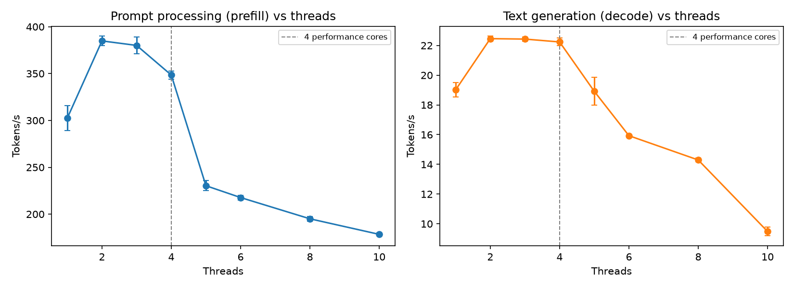
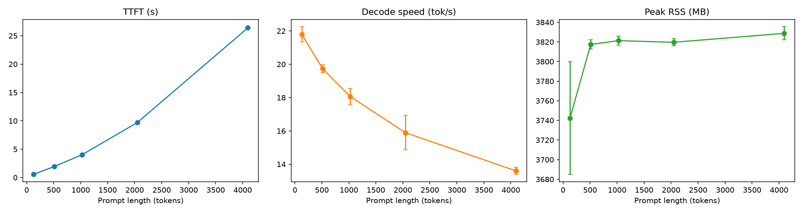
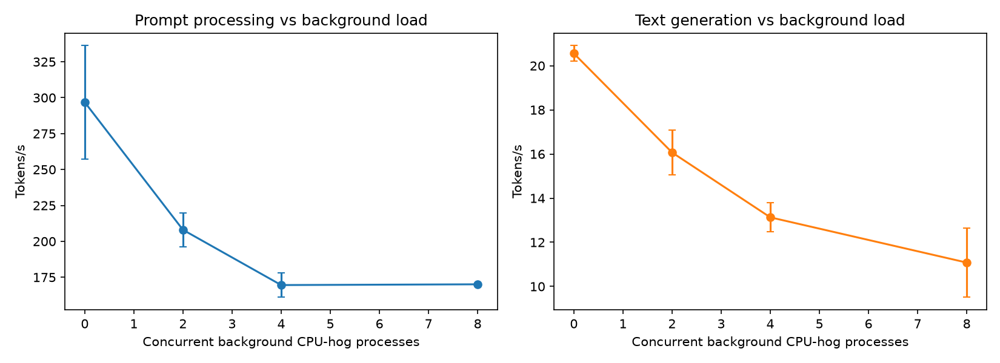
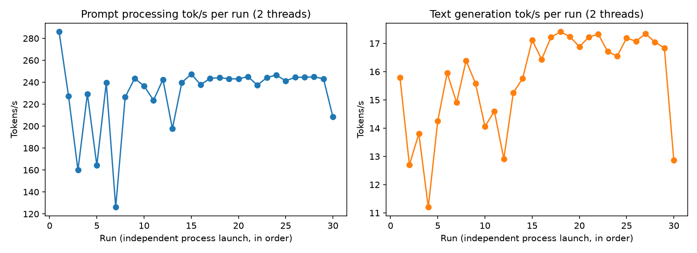

# Week 3 — CPU Performance Engineering

**Phase I — Understand CPU Inference** (Weeks 1–3) — final week of the phase.

## 1. What question are we investigating?

What determines CPU inference performance beyond raw FLOPs: how does thread count
interact with this machine's heterogeneous core layout, how does performance change
with context length beyond what Week 1 tested, how much does unrelated CPU load
degrade inference, and was Week 2's mysterious throughput decline actually thermal?

## 2. Why does the question matter?

This is the last week of Phase I and closes out several concrete open questions from
Weeks 1–2 (tracked in
[`docs/methodology/open-questions.md`](../../docs/methodology/open-questions.md)),
rather than opening the topic cold. It's also the last chance to characterize the raw
hardware before Phase II moves on to quantization and model comparison.

## 3. What is the hypothesis?

See [`hypothesis.md`](hypothesis.md). Summary: the Exp 2.2 thread-scaling collapse
should line up with the performance-core boundary (4); TTFT should keep growing (and
decode speed measurably drop) as context grows past 2048 tokens; background CPU load
should degrade throughput monotonically; and Week 2's Exp 2.3 decline should *not*
reproduce at the optimal thread count if it was really a bad-thread-count artifact.

## 4. What is the experimental setup?

- **Model/engine:** same as Week 2 — llama.cpp (CPU-only build) running
  `qwen2.5-1.5b-instruct-fp16.gguf`.
- **Hardware:** same Apple M4 as Weeks 1–2, now characterized precisely via
  `sysctl hw.perflevel0.physicalcpu hw.perflevel1.physicalcpu` (no root needed): **4
  performance cores + 6 efficiency cores = 10 total**.
- **Thermal instrumentation:** attempted via `pmset -g therm` (no root needed) in
  Experiment 3.4, but this Mac never populates it ("No thermal warning level has been
  recorded" throughout) — see limitations. Live core temperature/clock-speed
  (`powermetrics`) requires root and wasn't pursued.
- **Code:** [`scripts/exp_3_1_thread_scaling.py`](scripts/exp_3_1_thread_scaling.py)
  (reuses Week 2's `run_llama_bench`),
  [`scripts/exp_3_2_context_scaling.py`](scripts/exp_3_2_context_scaling.py) (reuses
  Week 1's `make_prompt_of_length` and Week 2's `run_llama_cli`),
  [`scripts/exp_3_3_background_load.py`](scripts/exp_3_3_background_load.py) (spawns
  `yes > /dev/null` processes as CPU hogs — no `stress`/`stress-ng` on this machine),
  [`scripts/exp_3_4_thermal_effects.py`](scripts/exp_3_4_thermal_effects.py) (reuses
  Week 2's `run_llama_bench_single_rep`), [`analysis/analyze.py`](analysis/analyze.py).
- **Config:** [`config/model.yaml`](config/model.yaml).

```bash
uv run python experiments/03-cpu-performance/scripts/exp_3_1_thread_scaling.py
uv run python experiments/03-cpu-performance/scripts/exp_3_2_context_scaling.py
uv run python experiments/03-cpu-performance/scripts/exp_3_3_background_load.py
uv run python experiments/03-cpu-performance/scripts/exp_3_4_thermal_effects.py
uv run python experiments/03-cpu-performance/analysis/analyze.py
```

## 5. What variables are controlled?

Model, engine, and — except where it's the swept variable — thread count. Experiments
3.2–3.4 all run at **2 threads**, this machine's throughput-optimal configuration per
Week 2 Exp 2.2 and confirmed again in Exp 3.1 below (not Weeks 1–2's 10 threads).

## 6. What variables are changed?

- **3.1:** thread count — 1, 2, 3, 4, 5, 6, 8, 10 (finer than Week 2's 1/2/4/8/10).
- **3.2:** prompt length — 128, 512, 1024, 2048, 4096 target tokens (Week 1 stopped at
  2048), fixed 64-token output, 5 repetitions each.
- **3.3:** concurrent background CPU-hog processes — 0, 2, 4, 8, 5 repetitions each.
- **3.4:** nothing swept — 30 independent process launches of the identical benchmark
  (512-token prefill, 128-token decode, 2 threads, no warmup), to observe run-to-run
  behavior over ~5.5 minutes of sustained load.

## 7. What metrics are collected?

Tokens/s (prefill and decode, via llama-bench), TTFT/decode time/peak RSS (via
llama-cli + `/usr/bin/time -l`, reusing Week 2's instrumentation), and best-effort
`pmset -g therm` samples in Experiment 3.4.

## 8. What are the results?

Raw: `results/raw/03-cpu-performance/`. Processed: `results/processed/03-cpu-performance/`.
Figures: `results/figures/03-cpu-performance/`.

### 3.1 — Thread Scaling (512-token prefill / 128-token decode, n=5 internal reps)

| threads | prefill tok/s | decode tok/s |
|---|---|---|
| 1 | 302.5 ± 13.2 | 19.0 ± 0.5 |
| 2 | 384.9 ± 5.1 | 22.5 ± 0.2 |
| 3 | 380.1 ± 9.1 | 22.4 ± 0.1 |
| 4 | 348.5 ± 4.3 | 22.2 ± 0.3 |
| 5 | 230.3 ± 5.4 | 18.9 ± 0.9 |
| 6 | 217.7 ± 2.6 | 15.9 ± 0.1 |
| 8 | 195.0 ± 2.5 | 14.3 ± 0.1 |
| 10 | 178.4 ± 1.6 | 9.5 ± 0.3 |



### 3.2 — Context Scaling (2 threads, 64-token output, n=5 reps)

| target prompt tokens | TTFT (s) | decode tok/s | peak RSS (MB) |
|---|---|---|---|
| 128 (actual 156) | 0.567 ± 0.015 | 21.80 ± 0.45 | 3742 ± 57 |
| 512 (actual 534) | 1.962 ± 0.043 | 19.73 ± 0.25 | 3817 ± 5 |
| 1024 (actual 1039) | 4.019 ± 0.132 | 18.06 ± 0.49 | 3821 ± 4 |
| 2048 (actual 2049) | 9.696 ± 0.154 | 15.89 ± 1.03 | 3820 ± 4 |
| 4096 (actual 4068) | 26.397 ± 0.194 | 13.60 ± 0.21 | 3829 ± 7 |



### 3.3 — Background Load (2 threads, 512-token prefill / 128-token decode, n=5 reps)

| background hogs | prefill tok/s | decode tok/s |
|---|---|---|
| 0 | 296.8 ± 39.5 | 20.6 ± 0.4 |
| 2 | 208.0 ± 11.9 | 16.1 ± 1.0 |
| 4 | 169.6 ± 8.5 | 13.1 ± 0.7 |
| 8 | 170.1 ± 0.8 | 11.1 ± 1.6 |



### 3.4 — Thermal Effects (30 independent runs, 2 threads, no warmup, ~333s total)

| test | mean tok/s | std | CV% | Pearson r vs run order | first-10 mean | last-10 mean |
|---|---|---|---|---|---|---|
| pp | 230.1 | 31.1 | 13.5% | **+0.32** | 213.9 | 240.0 |
| tg | 15.7 | 1.7 | 10.8% | **+0.56** | 14.5 | 16.6 |



## 9. How should the results be interpreted?

**The thread-scaling cliff lines up almost exactly with the performance-core
boundary** (Experiment 3.1). Throughput plateaus across 2–4 threads (pp: 384.9 → 380.1
→ 348.5; tg: 22.5 → 22.4 → 22.2 — essentially flat) and then drops sharply starting at
5 threads, continuing down through 10 (pp 178.4, tg 9.5 — roughly half the peak). This
machine has exactly **4 performance cores**, and the collapse begins the moment thread
count exceeds that number. This is a clean, direct confirmation of Week 2's
P-core/E-core hypothesis (tracker Q5) and answers Week 1's original thread-count
question (Q3): **the point of diminishing returns is 2–4 threads, and going further
doesn't just plateau, it actively regresses.**

**Context scaling reveals two things Week 1 couldn't see clearly.** First, TTFT grows
slightly *super-linearly*, not linearly, with prompt length: per-token prefill cost
rises from ~3.6 ms/token at 156 tokens to ~6.5 ms/token at 4068 tokens (a ~1.8x
increase) — consistent with self-attention's quadratic component becoming
non-negligible as context grows. Second, and more importantly, **decode speed clearly
decreases as context grows** (21.8 → 19.7 → 18.1 → 15.9 → 13.6 tok/s from 156 to 4068
prompt tokens, a ~38% drop), with tight error bars this time (unlike Week 1's noisy
fp32/Python data). This directly revises Week 1's tentative conclusion that decode
speed is "roughly constant regardless of prompt length" (Q4) — it isn't, because every
decode step attends over the *entire* KV cache, which keeps growing with context.
Peak RSS grows only modestly (3742 → 3829 MB, +87 MB from 156 to 4068 tokens) since
this model's KV cache is small relative to its weights (28 layers, 1536 hidden size).

**Background load degrades throughput monotonically but with diminishing marginal
harm** (Experiment 3.3). Going from 0 to 2 hogs costs ~30% of prefill throughput and
~22% of decode throughput; 2 to 4 hogs costs a further ~18%/~18%; but 4 to 8 hogs
barely moves prefill (169.6 → 170.1, essentially flat) while decode keeps declining
modestly (13.1 → 11.1). A plausible reading: once background load saturates enough
cores to force contention, adding *more* background load has little further effect on
the bulk prefill computation, but decode — issuing many small, latency-sensitive steps
— stays more sensitive to scheduling contention even as raw core availability
saturates.

**Week 2's Experiment 2.3 decline does *not* reproduce at the optimal thread count —
if anything, the opposite happens** (Experiment 3.4). At 10 threads, Week 2 saw a
strong, steady decline (Pearson r = −0.89 for pp) that plateaued low. At 2 threads,
this experiment instead shows noisy-but-not-declining behavior early on (runs 1–13
bounce between 126 and 286 pp tok/s) that then **stabilizes at a good, stable plateau**
for the rest of the run (runs 14–29 hold ~237–247 pp tok/s, ~17 tg tok/s), with only
one late outlier (run 30). Both metrics show a *positive* correlation with run order
(pp: r=+0.32, tg: r=+0.56) and the last-10-runs mean is *higher* than the first-10
(pp +12%, tg +15%) — the opposite direction from Week 2. This is a fairly direct answer
to tracker Q7/Q8: **Week 2's decline looks like it was substantially a consequence of
running at a bad (oversubscribed) thread count, not a generic, thread-count-independent
thermal effect** — running the same style of sustained-load sweep at the actual optimal
configuration does not reproduce the decline.

## 10. What are the limitations?

- **No direct thermal instrumentation.** `pmset -g therm` never populated any value on
  this machine across all of Experiment 3.4 (see `results/raw/03-cpu-performance/exp_3_4_therm_log.txt`).
  The Exp 3.4 conclusion rests on throughput behavior only, not measured temperature or
  clock frequency — `sudo powermetrics --samplers thermal,smc` would give a direct
  answer but requires root and wasn't pursued in this automated session.
- **Experiment 3.4's early noise (runs 1–13) is unexplained.** It doesn't look like
  Week 2's monotonic decline, but it isn't perfectly stable either — a plausible but
  unverified guess is residual system activity (e.g. filesystem cache state, leftover
  effects from Experiment 3.3's background hogs, which were killed before 3.4 started
  but may leave transient scheduler state) settling over the first couple of minutes.
- **Background-load hogs (`yes > /dev/null`) are single-threaded and trivially
  cheap per-instruction**, unlike more realistic contention (e.g. another memory-bound
  process). The dose-response shape might differ under memory-bandwidth-heavy
  background load rather than pure compute-bound busy-loops.
- **Single machine, single model, F16 only** — as in Weeks 1–2, nothing here
  generalizes across hardware or quantization levels yet.
- **Experiment 3.2's longest context (4068 actual tokens) is still only half this
  model's 8192-token context window** — the super-linear TTFT trend might steepen
  further closer to the context limit; untested.

## 11. What new questions emerged?

- Would `sudo powermetrics` confirm or refute the thermal-vs-thread-count conclusion
  from Experiment 3.4 directly, via real clock-frequency data?
- Does the Experiment 3.4 early-run noise (runs 1–13) disappear if the machine is left
  idle for a few minutes before starting, ruling out leftover state from Exp 3.3?
- Does decode speed keep declining smoothly as context approaches the model's 8192-token
  limit, or does it break down non-smoothly near the limit?
- Would memory-bandwidth-bound background load (rather than pure compute busy-loops)
  produce a different, perhaps steeper, degradation curve in Experiment 3.3?
- Now that Phase I has characterized the raw hardware/engine behavior thoroughly, how
  much of it changes once quantization reduces both compute and memory-bandwidth
  demands (Phase II, Weeks 4–6)?

All of these, along with every other week's, are tracked in
[`docs/methodology/open-questions.md`](../../docs/methodology/open-questions.md), which
this week updates to close out Q3, Q4 (Week 1) and Q5, Q7, Q8 (Week 2).

## Phase I Synthesis

This is the last week of Phase I. The synthesis across all three weeks — Python vs
llama.cpp, thread/context/load/thermal behavior, and open questions carried into
Phase II — is written up separately as the Phase I final deliverable:
[`reports/benchmarks/cpu-inference-performance-report-v1.md`](../../reports/benchmarks/cpu-inference-performance-report-v1.md).
