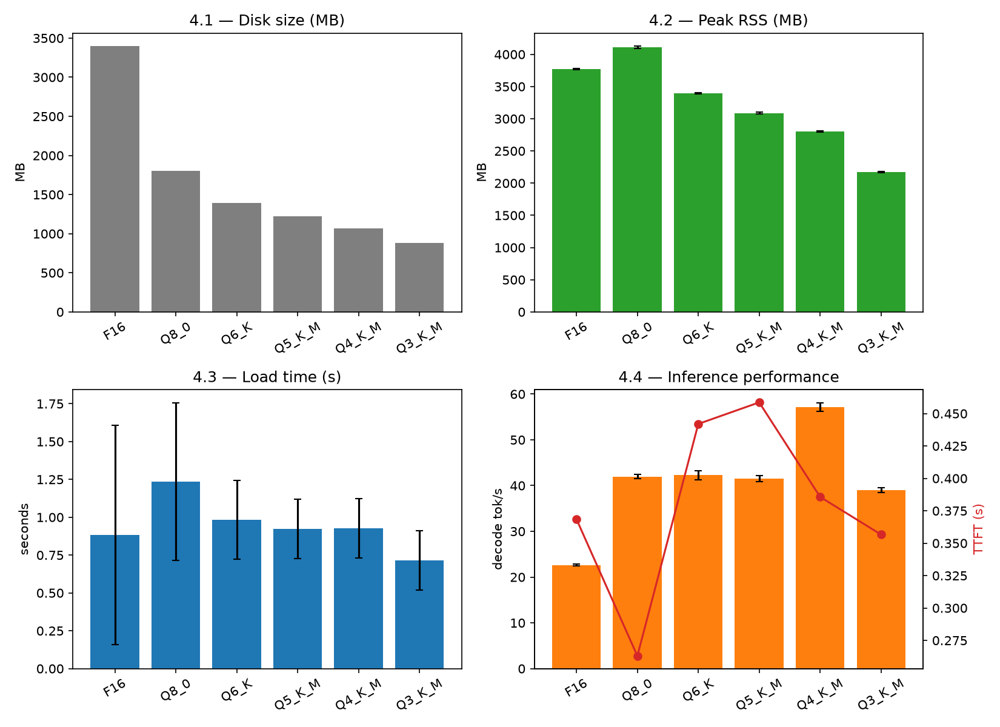

# Week 4 — Quantization Fundamentals

**Phase II — Measure Models and Quantization** (Weeks 4–6)

> New to this week's vocabulary (FP32/FP16/INT8/INT4, quantization error, scales,
> groups, GGUF quantization formats, ...)? See the
> [Week 4 glossary](../../docs/methodology/glossary.md#week-4--quantization-fundamentals).

## 1. What question are we investigating?

How do disk size, memory use, loading time, and inference speed change as the same
model gets quantized more aggressively — and does that relationship stay simple and
monotonic, or does it depend on which specific GGUF quantization format is used?

## 2. Why does the question matter?

This is the first week of Phase II and the natural next step after Phase I: Weeks
1–3 characterized engine, thread, context, and environmental effects on one
precision (F16 llama.cpp / fp32 Python). This week asks what changes as precision
itself becomes the variable — before Week 5 asks the harder question of what
quality is lost in exchange.

## 3. What is the hypothesis?

See [`hypothesis.md`](hypothesis.md). Summary (deliberately naive, to be tested):
size, memory, load time, and inference speed should all improve monotonically from
F16 down to Q3_K_M.

## 4. What is the experimental setup?

- **Model:** `Qwen/Qwen2.5-1.5B-Instruct`, same as every prior week.
- **Quantization levels:** F16 (Week 2's unquantized reference) plus five GGUF
  quantizations — Q8_0, Q6_K, Q5_K_M, Q4_K_M, Q3_K_M — matching FULL-ROADMAP.md's
  suggested "Q8, Q6, Q5, Q4, Q3" (using the generally-higher-quality `_K` variants
  over the older plain Q4_0/Q5_0 formats also published in the same repo).
- **Engine:** llama.cpp (CPU-only build from Week 2), **2 threads** (this machine's
  throughput-optimal configuration, per Week 2/3).
- **Code:** [`scripts/download_quantized_ggufs.sh`](scripts/download_quantized_ggufs.sh),
  [`scripts/quantization_benchmark.py`](scripts/quantization_benchmark.py) (covers
  Experiments 4.1–4.4 together — reusing Week 2's `run_llama_cli` — since they're all
  the same underlying per-quant-level measurement, not four separate benchmark runs),
  [`analysis/analyze.py`](analysis/analyze.py).
- **Config:** [`config/model.yaml`](config/model.yaml).

```bash
experiments/04-quantization/scripts/download_quantized_ggufs.sh
uv run python experiments/04-quantization/scripts/quantization_benchmark.py
uv run python experiments/04-quantization/analysis/analyze.py
```

## 5. What variables are controlled?

Model, engine, thread count (2), prompt, and output length (64 tokens) — only the
quantization level changes between conditions.

## 6. What variables are changed?

Quantization level: F16, Q8_0, Q6_K, Q5_K_M, Q4_K_M, Q3_K_M. 10 repetitions per level.

## 7. What metrics are collected?

Disk size (4.1), peak RSS (4.2), load time (4.3), TTFT and decode speed (4.4) — all
in one pass per quantization level, via `/usr/bin/time -l` and llama.cpp's `--perf`
instrumentation (same methodology as Week 2 Exp 2.1 / Week 3).

## 8. What are the results?

Raw: `results/raw/04-quantization/quantization_benchmark.csv`. Processed:
`results/processed/04-quantization/`. Figure: `results/figures/04-quantization/quantization_benchmark.png`.

| quant level | disk (MB) | load time, steady-state (s) | peak RSS (MB) | TTFT (s) | decode (tok/s) |
|---|---|---|---|---|---|
| F16 | 3395.5 | 0.653 ± 0.002 | 3771.5 ± 5.1 | 0.369 ± 0.007 | 22.63 ± 0.20 |
| Q8_0 | 1806.8 | 1.071 ± 0.003 | 4108.5 ± 16.5 | 0.263 ± 0.004 | 41.98 ± 0.47 |
| Q6_K | 1396.3 | 0.906 ± 0.091 | 3397.4 ± 10.5 | 0.442 ± 0.017 | 42.25 ± 0.97 |
| Q5_K_M | 1225.9 | 0.860 ± 0.003 | 3088.1 ± 12.0 | 0.459 ± 0.019 | 41.56 ± 0.67 |
| Q4_K_M | 1065.6 | 0.866 ± 0.003 | 2798.7 ± 8.5 | 0.386 ± 0.011 | **57.15 ± 0.90** |
| Q3_K_M | 881.6 | 0.654 ± 0.002 | 2172.4 ± 8.2 | 0.357 ± 0.005 | 38.99 ± 0.48 |

(Load time shown excludes each level's first, cold-file-cache run — see Week 1 Exp
1.1 / limitations. Including it doesn't change the ranking, just adds noise.)



## 9. How should the results be interpreted?

**Disk size is the one metric that behaves exactly as hypothesized** — a clean,
monotonic drop from 3395.5 MB (F16) to 881.6 MB (Q3_K_M), tracking each format's
bits-per-weight as expected. Nothing else is this simple.

**Peak memory is not monotonic with disk size: Q8_0 uses *more* RAM than the file
twice its size.** F16 (3395.5 MB on disk) peaks at 3771.5 MB RSS; Q8_0 (1806.8 MB on
disk, roughly half of F16) peaks at **4108.5 MB** — the highest of any level tested,
quantized or not. Below Q8_0, the ranking does become monotonic again (Q6_K 3397.4 →
Q5_K_M 3088.1 → Q4_K_M 2798.7 → Q3_K_M 2172.4 MB). The likely mechanism: computing
with quantized weights needs the CPU backend to reconstruct floating-point values
from the packed/scaled representation before doing matrix math, which costs extra
working memory beyond the weights themselves — for Q8_0 specifically, that overhead
apparently outweighs the file-size savings versus F16.

**Load time is fastest at both ends of the precision range, and slowest in the
middle** — the opposite of "smaller file loads faster." Steady-state load time is
0.653s for F16 and 0.654s for Q3_K_M (statistically indistinguishable), while Q8_0
(1.071s), Q6_K (0.906s), Q5_K_M (0.860s), and Q4_K_M (0.866s) all take longer despite
every one of them being a smaller file than F16. The most likely explanation: this
llama.cpp build reports `REPACK = 1` in its CPU feature line (see Week 2 exploration),
meaning it can repack certain quantized tensor layouts into a different in-memory
layout for faster SIMD access *at load time* — a one-time cost F16 doesn't pay
(nothing to repack) and that Q3_K_M's specific block structure apparently doesn't
trigger either, while the four formats in between do.

**Decode speed splits cleanly into three tiers, not a smooth curve, and the fastest
tier isn't the smallest model.** F16 is slowest (22.63 tok/s) — expected, it's doing
full-precision math. Q8_0/Q6_K/Q5_K_M cluster tightly around 41.6–42.3 tok/s despite
spanning a 1.5x difference in file size. **Q4_K_M is the clear outlier at 57.15
tok/s** — 36% faster than its immediate neighbors and the fastest of any level tested.
Q3_K_M, the smallest file of all, is actually the *slowest quantized* format (38.99
tok/s) — slower than Q8_0, Q6_K, and Q5_K_M, and barely faster than nothing. TTFT
shows a related but not identical pattern (Q8_0 fastest at 0.263s, Q6_K/Q5_K_M
slowest at ~0.44-0.46s despite being smaller than F16). This is best explained by
**how well each format's specific block structure maps onto this CPU's optimized SIMD
kernels** (ARM NEON dot-product/matmul-int8 instructions favor some quantization
block layouts much more than others) rather than by bit-width alone — exactly the
"scales and groups" mechanics this week's learning objectives point at, and a
concrete illustration of why "quantization format" is a more useful unit of analysis
than "number of bits."

## 10. What are the limitations?

- **No quality measurement yet.** Every one of these numbers describes cost, not
  correctness — a quantization level being fast is not the same as it being *good*.
  That's Week 5's job, using this week's evaluation dataset.
- **Kernel-optimization explanations for the load-time and decode-speed patterns are
  plausible, not confirmed.** Nothing here traced actual llama.cpp source code or
  profiled which code path each quant format takes — the `REPACK` flag and known
  ARM NEON kernel specialization are circumstantial, strong-but-indirect evidence.
- **Single machine, single model family.** Apple M4's specific ARM feature set
  (`DOTPROD`, `MATMUL_INT8`, `SME`) shapes which quant formats run fastest here;
  results would very plausibly differ on x86 or older ARM hardware without these
  extensions.
- **Only one prompt/output-length configuration tested** (the Week 1-3 continuity
  prompt, 64 generated tokens) — Week 3 already showed context length changes decode
  speed considerably; that interaction with quantization format isn't tested here.

## 11. What new questions emerged?

- Does the Q8_0 peak-memory anomaly and the Q6_K/Q5_K_M/Q4_K_M load-time gap actually
  come from `REPACK`, or something else? Worth checking with `llama-cli --verbose`
  logs for repacking-related lines, or a build with `-DGGML_CPU_REPACK=OFF` for
  comparison.
- Does Q4_K_M's decode-speed advantage hold on different hardware (x86, older ARM
  without `MATMUL_INT8`/`SME`), or is it specific to this chip's kernel support?
- Now that Experiment 4.4 shows real quality-independent performance differences
  between formats, which of these is actually worth using — i.e., how much quality
  does each format cost? (Week 5, directly, using the [evaluation dataset
  v1](../../evaluation/datasets/README.md) built this week.)
- Does the same non-monotonic pattern (memory, load time, decode speed) show up on a
  larger or smaller model than this 1.5B one, or is it specific to this model's
  tensor shapes interacting with these quant block sizes?

This week's evaluation dataset (`evaluation/datasets/v1.jsonl`, 100 examples across 6
categories × 2 languages) is documented separately in
[`evaluation/datasets/README.md`](../../evaluation/datasets/README.md) — it's a
deliverable of this week but isn't itself an "experiment" with a hypothesis, so it
doesn't get its own numbered section here.

All open questions, from every week, are tracked in
[`docs/methodology/open-questions.md`](../../docs/methodology/open-questions.md),
which this week updates to partially close Q6.
