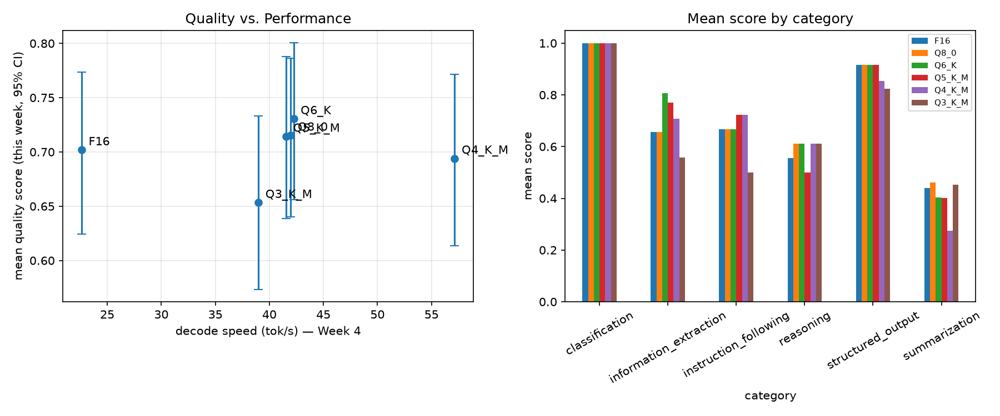

# Week 5 — Quantization vs Quality

**Phase II — Measure Models and Quantization** (Weeks 4–6)

> New to this week's vocabulary (bootstrap confidence interval, effect size, Pareto
> frontier, JSON validity, instruction compliance, ...)? See the
> [Week 5 glossary](../../docs/methodology/glossary.md#week-5--quantization-vs-quality).

## 1. What question are we investigating?

How much output *quality* is actually lost as the same model gets quantized more
aggressively — and does the quality curve track the speed/memory curve Week 4 found,
or move independently of it?

## 2. Why does the question matter?

Week 4 measured cost (size, memory, load time, decode speed) across six quantization
levels of the same model and found none of it behaved as the naive "fewer bits →
worse in every way except speed" intuition predicted — Q4_K_M was the fastest decode
format tested, not the least quantized, and Q8_0 used more peak memory than
unquantized F16. None of that says anything about *quality*, though: a format being
fast is not the same as it being good. This week closes that gap using the 100-example
evaluation dataset built in Week 4, producing the central Phase II artifact — a
quality-vs-performance Pareto plot — and setting up Week 6's multi-model comparison.

## 3. What is the hypothesis?

See [`hypothesis.md`](hypothesis.md). Summary (deliberately naive, to be tested):
quality decreases monotonically from F16 to Q3_K_M, roughly uniformly across task
categories.

## 4. What is the experimental setup?

- **Model & quantization levels:** same as Week 4 — `Qwen/Qwen2.5-1.5B-Instruct`,
  F16 + Q8_0/Q6_K/Q5_K_M/Q4_K_M/Q3_K_M GGUF files already downloaded in Week 4.
- **Dataset:** [`evaluation/datasets/v1.jsonl`](../../evaluation/datasets/v1.jsonl)
  (100 examples, 6 categories × 2 languages, built in Week 4).
- **Engine:** llama.cpp's `llama-server`, not `llama-cli`. Week 2-4 used `llama-cli`
  (one subprocess per measurement, reloading the model every time), which is fine for
  a handful of timing repetitions but would waste most of 600 generations' wall time
  on reloading. This week starts `llama-server` once per quantization level and sends
  each dataset example as a separate request to its OpenAI-compatible chat endpoint —
  incidentally the same serving mode Weeks 7-9 will build a production gateway around.
- **Generation:** greedy decoding (temperature 0, fixed seed) for reproducibility,
  256 max output tokens (raised from an initial 128 after a first pass showed 18/100
  reasoning items hitting the cap mid-derivation), llama.cpp's default chat template
  application per model (Qwen2.5-Instruct's own template, embedded in the GGUF).
- **Scoring:** heuristic, non-LLM-judge scorers per category (exact match, JSON
  field/value matching, token-F1 lexical overlap, numeric/constraint checkers) — see
  [`evaluation/metrics/scorers.py`](../../evaluation/metrics/scorers.py) and its
  module docstring for the "why not an LLM judge" rationale (FULL-ROADMAP.md's
  explicit Week 5 brief).
- **Code:**
  [`evaluation/runners/llama_server_runner.py`](../../evaluation/runners/llama_server_runner.py),
  [`evaluation/prompts/templates.py`](../../evaluation/prompts/templates.py),
  [`evaluation/metrics/scorers.py`](../../evaluation/metrics/scorers.py),
  [`scripts/run_evaluation.py`](scripts/run_evaluation.py) (drives the 6×100
  generations), [`analysis/score.py`](analysis/score.py) (applies scorers),
  [`analysis/analyze.py`](analysis/analyze.py) (statistics + Pareto plot).
- **Config:** [`config/model.yaml`](config/model.yaml).

```bash
uv run python experiments/05-quantization-quality/scripts/run_evaluation.py
uv run python experiments/05-quantization-quality/analysis/score.py
uv run python experiments/05-quantization-quality/analysis/analyze.py
```

## 5. What variables are controlled?

Model, dataset, engine, thread count (2, Week 2/3's throughput-optimal setting),
decoding parameters (temperature, seed, max tokens), and prompt template — only the
quantization level changes between conditions.

## 6. What variables are changed?

Quantization level: F16, Q8_0, Q6_K, Q5_K_M, Q4_K_M, Q3_K_M. 100 dataset examples per
level (600 generations total), each scored once (deterministic decoding, so repeated
runs are expected to reproduce the same output modulo floating-point nondeterminism —
not independently repeated per example the way Week 1-4's timing measurements were).

## 7. What metrics are collected?

Per-example quality score in [0, 1] (binary for most categories, partial-credit for
`information_extraction`/`structured_output` field matching and continuous for
`summarization`'s token-F1), JSON validity rate, plus generation timing (TTFT, decode
tok/s) as a secondary cross-check against Week 4's `llama-cli`-measured numbers.
Aggregated into: overall mean score with bootstrap 95% CI per level, per-category
means, paired effect size vs. the F16 baseline (mean score difference + Cohen's dz,
paired because every level is scored on the identical 100 examples), and a failure-
category breakdown.

## 8. What are the results?

Raw: `results/raw/05-quantization-quality/raw_outputs.jsonl` (600 rows). Processed:
`results/processed/05-quantization-quality/`. Figure:
`results/figures/05-quantization-quality/quality_vs_performance.png`.

**Overall quality score (bootstrap 95% CI, n=100), joined with Week 4's decode speed:**

| quant level | mean score | 95% CI | Δ vs. F16 | decode tok/s (Week 4) |
|---|---|---|---|---|
| F16 | 0.702 | [0.624, 0.773] | — | 22.63 |
| Q8_0 | 0.715 | [0.640, 0.786] | +0.013 (n.s.) | 41.98 |
| Q6_K | **0.731** | [0.656, 0.801] | +0.029 (n.s.) | 42.25 |
| Q5_K_M | 0.714 | [0.639, 0.788] | +0.012 (n.s.) | 41.56 |
| Q4_K_M | 0.694 | [0.614, 0.772] | −0.008 (n.s.) | **57.15** |
| Q3_K_M | 0.653 | [0.573, 0.733] | −0.049 (n.s., CI edge) | 38.99 |

"n.s." = the paired bootstrap 95% CI on the score difference vs. F16 includes 0 (see
`results/processed/05-quantization-quality/effect_sizes_vs_f16.csv` for exact bounds
and Cohen's dz, all \|dz\| < 0.13 — small effects even where directionally consistent).

**Per-category mean score:**

| category | F16 | Q8_0 | Q6_K | Q5_K_M | Q4_K_M | Q3_K_M |
|---|---|---|---|---|---|---|
| classification | 1.000 | 1.000 | 1.000 | 1.000 | 1.000 | 1.000 |
| structured_output | 0.917 | 0.917 | 0.917 | 0.917 | 0.854 | 0.823 |
| information_extraction | 0.656 | 0.656 | 0.807 | 0.771 | 0.708 | 0.557 |
| instruction_following | 0.667 | 0.667 | 0.667 | 0.722 | 0.722 | 0.500 |
| reasoning | 0.556 | 0.611 | 0.611 | 0.500 | 0.611 | 0.611 |
| summarization | 0.439 | 0.460 | 0.404 | 0.402 | 0.275 | 0.453 |

**JSON validity:** 100% at every level except Q3_K_M (96.9%) — the only level that
ever emitted syntactically broken JSON.



## 9. How should the results be interpreted?

**The naive hypothesis is false: quality does not decline monotonically, and where it
does decline the effect is small and not statistically significant against this
100-example benchmark — except at the very bottom.** Q6_K (0.731) scores *higher*
than unquantized F16 (0.702), and Q8_0/Q5_K_M are statistically indistinguishable from
F16 as well. Only Q3_K_M shows a real (if formally non-significant, CI upper bound
0.027) downward trend, and it's also the only level to ever produce invalid JSON. The
takeaway isn't "quantization is free" — it's that *for this model, this dataset, down
to Q4_K_M*, quantization noise is smaller than this benchmark's example-to-example
variance, echoing Week 4's finding that "more bits" doesn't cleanly predict outcomes
once you're inside the `_K`-format range.

**Quality loss is not remotely uniform across categories, contradicting the
hypothesis's second half.** `classification` saturates at a perfect 1.000 at every
level (a ceiling effect — see limitations) and `structured_output` barely moves
(0.917→0.823, a real but small decline). `information_extraction` and
`instruction_following`, by contrast, are far noisier and both show their sharpest
drop specifically at Q3_K_M (extraction 0.708→0.557; instruction-following
0.722→0.500). The Q3_K_M instruction-following drop is a genuine content-quality
failure, not a formatting one: the number of examples that got the *format* right but
the *content* wrong roughly doubles at Q3_K_M (9/18) versus every higher level
(4-6/18) — see `results/processed/05-quantization-quality/failure_breakdown.csv`.

**The single most interesting failure mode is language-switching, and it's sharply
non-monotonic.** For the 8 Italian summarization examples, the model answered in
English instead of Italian 0 times at F16, Q8_0, and Q3_K_M, but **7 out of 8 times at
Q4_K_M** (1 at Q6_K, 2 at Q5_K_M) — a spike, not a trend, entirely responsible for
Q4_K_M's summarization category mean (0.275) being the lowest of any level, category
pair in this experiment. Since the scorer is lexical-overlap against an Italian
reference, an English answer scores near zero almost by construction — this is the
metric correctly penalizing genuinely wrong-language output, not a scoring artifact.
Aggregated over *all* categories, Italian-language examples score lower than English
at every quantization level (e.g. F16: 0.747 EN vs. 0.657 IT; Q3_K_M: 0.725 EN vs.
0.582 IT — see `results/processed/05-quantization-quality/scored_outputs.csv`), so
multilingual capability is both weaker to start with and more fragile under
quantization than English-only capability would suggest.

**Combining this week's quality numbers with Week 4's decode speed produces a small,
clean Pareto frontier: only Q6_K and Q4_K_M are not dominated on the speed/quality
plane.** F16, Q8_0, Q5_K_M, and Q3_K_M are all beaten on *both* axes simultaneously by
at least one other level — most strikingly Q3_K_M, which is slower than Q8_0/Q6_K/
Q5_K_M (38.99 tok/s vs. 41-42) *and* lower quality than all of them, despite being the
most aggressively quantized. Q6_K is the best-quality point tested (0.731) at
roughly 1.9x F16's decode speed; Q4_K_M is the fastest point tested (57.15 tok/s,
2.5x F16) at a quality statistically indistinguishable from F16. For this model, on
this hardware, "quantize until it breaks" is the wrong mental model — the actual
choice is a two-point frontier between "best quality, still ~2x faster than F16" and
"fastest available, quality basically free."

## 10. What are the limitations?

- **Classification is saturated (ceiling effect) and contributes no signal to the
  quantization comparison.** The category only reached 100% after a mid-experiment
  prompt fix (see below) that surfaces the closed label set to the model — a stronger
  test would need harder, more ambiguous classification items in a future dataset
  version to actually discriminate between quantization levels.
- **A first evaluation pass exposed three prompt/scorer bugs, fixed before the run
  reported above (not survivorship-biased — the fixes were applied and the *entire*
  600-generation run was repeated from scratch, not selectively re-scored):**
  classification prompts didn't originally surface `metadata.labels` to the model,
  causing it to answer the meta-question ("Topic") instead of a label at every
  quantization level equally; the reasoning scorer originally took the *first* number
  in the output instead of the *last*, misgrading worked solutions that restate an
  input value before the final answer; and `information_extraction` originally
  required exact key-name matches despite its prompts never specifying key names
  (unlike `structured_output`, which does), unfairly penalizing correct extractions
  filed under a different but reasonable key. This is disclosed rather than hidden
  because it's a real methodological lesson: **an evaluation harness needs its own
  validation pass (the self-scoring sanity check in this week's code) before its
  output can be trusted**, the same way Week 1-4 needed to validate the measurement
  methodology itself before trusting the numbers it produced.
- **Heuristic scorers, not an LLM judge — by design (see §4), but with real
  precision costs.** `summarization`'s token-F1 is lexical overlap, not semantic
  similarity; a correct paraphrase with little word overlap would be under-scored.
  `information_extraction`'s value-presence matching doesn't handle differently
  *formatted* but semantically identical values (e.g. "July 14, 2025" vs.
  "2025-07-14") — these count as misses.
- **No statistically significant differences from F16 at any level except a
  borderline one at Q3_K_M**, at n=100 examples. This is a real finding, not just an
  underpowered one — but a larger dataset (Week 4 already flagged extending
  v1 toward the roadmap's 200-example target) would tighten the confidence intervals
  enough to say more about the smaller, real-looking effects (e.g. Q4_K_M's -0.008).
- **Single model, single machine.** As with Week 4, whether this quality curve (and
  especially the Q4_K_M language-switching spike) looks anything like this on a
  different model family or size is untested — directly relevant to Week 6.

## 11. What new questions emerged?

- Why does Q4_K_M specifically spike in Italian-language switching (7/8 summarization
  examples) when neither its higher-precision nor lower-precision neighbors show the
  same failure? Worth checking whether this reproduces with a different prompt
  phrasing or is specific to this exact system prompt wording.
- Would a harder, more adversarial classification set (ambiguous cases, more labels,
  no explicit label list) actually show a monotonic quantization effect, now that this
  version has hit a ceiling?
- Does the Q6_K/Q4_K_M two-point Pareto frontier found here hold on a different model
  size, or is "best quality" vs. "fastest" landing on different specific formats an
  artifact of this 1.5B model's tensor shapes (echoing Week 4's open question about
  whether its non-monotonic speed pattern generalizes)?
- How much would extending the dataset toward the roadmap's 200-example target change
  which of Week 5's "not statistically significant" differences (e.g. Q4_K_M's -0.008)
  would actually resolve as real, small effects with a tighter CI?

All open questions, from every week, are tracked in
[`docs/methodology/open-questions.md`](../../docs/methodology/open-questions.md),
which this week updates to close Q16 and add four new entries.
