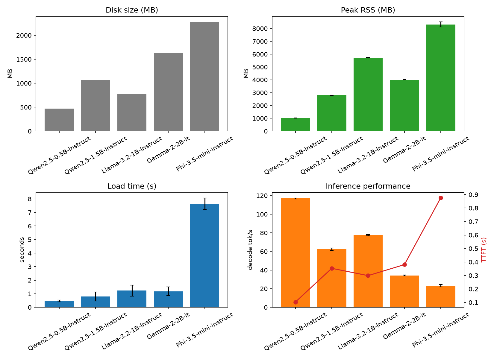
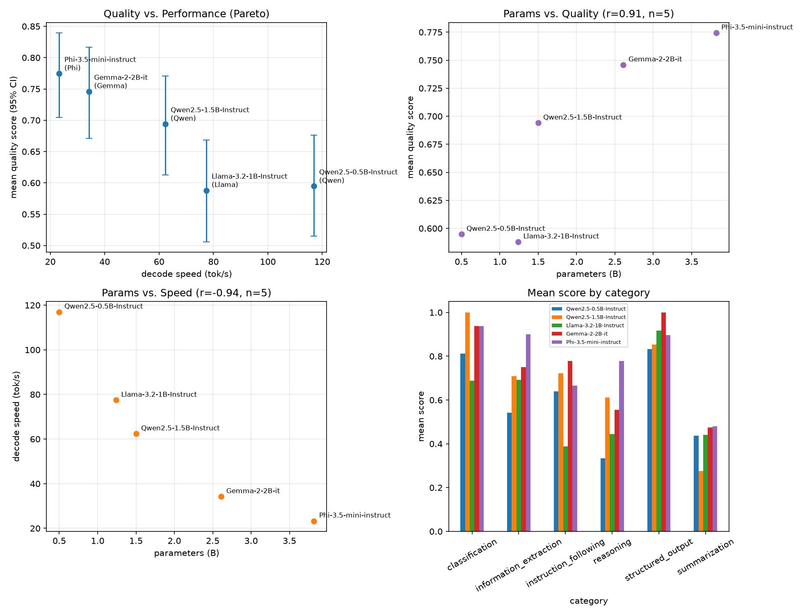

# Week 6 — Small Model Comparison

**Phase II — Measure Models and Quantization** (Weeks 4–6, final week)

> New to this week's vocabulary? See the
> [Week 6 glossary](../../docs/methodology/glossary.md#week-6--small-model-comparison).

## 1. What question are we investigating?

Weeks 4-5 varied *quantization level* while holding the model constant. This week
varies the *model* while holding quantization constant (Q4_K_M throughout — Week 4/5's
speed-Pareto-optimal format): does parameter count predict quality and latency across
5 different small models, and which one gives the best quality/performance tradeoff on
this CPU?

## 2. Why does the question matter?

This is Phase II's final week and its capstone deliverable — the CPU Small Language
Model Benchmark (see `reports/benchmarks/`). Weeks 1-5 characterized one model
(`Qwen2.5-1.5B-Instruct`) in exhaustive detail; that depth is only useful if it
generalizes, or if its limits are known. Comparing across model families is also the
direct prerequisite for Phase IV's "when is an SLM the right choice" question (Weeks
10-11) — you can't make an architecture decision from one data point.

## 3. What is the hypothesis?

See [`hypothesis.md`](hypothesis.md). Summary (deliberately naive, to be tested):
parameter count positively predicts quality and negatively predicts decode speed,
consistently across all 5 models.

## 4. What is the experimental setup?

- **Models (5, spanning 4 families, 0.5B-3.82B params, all Q4_K_M):**

  | model | family | params (B) | GGUF source |
  |---|---|---|---|
  | Qwen2.5-0.5B-Instruct | Qwen | 0.50 | `Qwen/Qwen2.5-0.5B-Instruct-GGUF` (official) |
  | Qwen2.5-1.5B-Instruct | Qwen | 1.50 | `Qwen/Qwen2.5-1.5B-Instruct-GGUF` (official, reused from Week 4) |
  | Llama-3.2-1B-Instruct | Llama | 1.24 | `bartowski/Llama-3.2-1B-Instruct-GGUF` |
  | Gemma-2-2B-it | Gemma | 2.61 | `bartowski/gemma-2-2b-it-GGUF` |
  | Phi-3.5-mini-instruct | Phi | 3.82 | `bartowski/Phi-3.5-mini-instruct-GGUF` |

  Selection followed FULL-ROADMAP.md's criteria: different parameter counts, different
  families, CPU/GGUF availability (all non-gated, all with either an official or a
  well-established community quantizer's Q4_K_M build), and multilingual capability
  (all 4 families publish multilingual claims — Week 6 tests this directly via the
  dataset's Italian half).
- **Dataset & scoring:** identical to Week 5 —
  [`evaluation/datasets/v1.jsonl`](../../evaluation/datasets/v1.jsonl) (100 examples),
  [`evaluation/metrics/scorers.py`](../../evaluation/metrics/scorers.py). Both are
  fully model-agnostic; no changes were needed to reuse them here.
- **Engines:** `llama-cli` for the speed/memory benchmark (Week 2/4 methodology,
  reusing `run_llama_cli`), `llama-server` for the quality evaluation (Week 5
  methodology, reusing [`evaluation/runners/llama_server_runner.py`](../../evaluation/runners/llama_server_runner.py)
  and [`evaluation/prompts/templates.py`](../../evaluation/prompts/templates.py)
  unmodified — both only need a GGUF path, so they generalized to new models with zero
  code changes).
- **Generation:** greedy decoding (temperature 0, fixed seed), 256 max output tokens,
  each model's own embedded chat template applied automatically by llama.cpp (Gemma-2's
  system-role handling in particular was verified to work without errors — see §10).
- **Code:**
  [`scripts/download_models.sh`](scripts/download_models.sh),
  [`scripts/model_benchmark.py`](scripts/model_benchmark.py) (speed/memory, Week 4-style),
  [`scripts/run_evaluation.py`](scripts/run_evaluation.py) (quality, Week 5-style),
  [`analysis/analyze_benchmark.py`](analysis/analyze_benchmark.py),
  [`analysis/score.py`](analysis/score.py),
  [`analysis/analyze_quality.py`](analysis/analyze_quality.py) (correlations, Pareto
  plot, per-language/per-category/JSON-validity breakdowns).
- **Config:** [`config/model.yaml`](config/model.yaml).

```bash
bash experiments/06-model-comparison/scripts/download_models.sh
uv run python experiments/06-model-comparison/scripts/model_benchmark.py
uv run python experiments/06-model-comparison/analysis/analyze_benchmark.py
uv run python experiments/06-model-comparison/scripts/run_evaluation.py
uv run python experiments/06-model-comparison/analysis/score.py
uv run python experiments/06-model-comparison/analysis/analyze_quality.py
```

## 5. What variables are controlled?

Hardware, inference engine, quantization level (Q4_K_M for every model), thread count
(2), dataset, prompt template shape, decoding parameters, and repetitions (10 for the
speed benchmark, 100 dataset examples for quality) — only the model varies.

## 6. What variables are changed?

Model: Qwen2.5-0.5B-Instruct, Qwen2.5-1.5B-Instruct, Llama-3.2-1B-Instruct,
Gemma-2-2B-it, Phi-3.5-mini-instruct.

## 7. What metrics are collected?

Disk size, peak RSS, load time, TTFT, decode tok/s (speed benchmark, 10 reps/model);
per-example quality score in [0, 1], JSON validity, per-category and per-language
means (quality evaluation, 100 examples/model). Combined into: bootstrap 95% CIs,
Pearson correlations between parameter count and both quality and speed (n=5,
descriptive only — see limitations), a quality-vs-performance Pareto analysis, and
tokens/sec per billion parameters as a CPU-efficiency measure.

## 8. What are the results?

Raw: `results/raw/06-model-comparison/{model_benchmark.csv,raw_outputs.jsonl}`.
Processed: `results/processed/06-model-comparison/`. Figures:
`results/figures/06-model-comparison/{model_benchmark.png,quality_vs_performance.png}`.

**Speed & memory (10 reps/model):**

| model | family | params (B) | disk (MB) | load (s) | peak RSS (MB) | TTFT (s) | decode (tok/s) | tok/s per B params |
|---|---|---|---|---|---|---|---|---|
| Qwen2.5-0.5B-Instruct | Qwen | 0.50 | 469 | 0.47 | 1023 | 0.103 | **116.98** | **234.0** |
| Qwen2.5-1.5B-Instruct | Qwen | 1.50 | 1066 | 0.80 | 2796 | 0.353 | 62.37 | 41.6 |
| Llama-3.2-1B-Instruct | Llama | 1.24 | 770 | 1.23 | **5721** | 0.299 | 77.44 | 62.5 |
| Gemma-2-2B-it | Gemma | 2.61 | 1629 | 1.18 | 4003 | 0.380 | 34.22 | 13.1 |
| Phi-3.5-mini-instruct | Phi | 3.82 | 2282 | **7.65** | 8320 | 0.877 | 23.29 | 6.1 |

**Quality (100 examples/model, bootstrap 95% CI):**

| model | mean score | 95% CI | JSON validity |
|---|---|---|---|
| Qwen2.5-0.5B-Instruct | 0.595 | [0.515, 0.676] | 100% |
| Qwen2.5-1.5B-Instruct | 0.694 | [0.613, 0.771] | 100% |
| Llama-3.2-1B-Instruct | 0.588 | [0.506, 0.669] | 100% |
| Gemma-2-2B-it | 0.746 | [0.671, 0.816] | 100% |
| Phi-3.5-mini-instruct | **0.774** | [0.704, 0.840] | 100% |

**Per-category mean score:**

| category | Qwen-0.5B | Qwen-1.5B | Llama-1B | Gemma-2B | Phi-3.5 |
|---|---|---|---|---|---|
| classification | 0.812 | 1.000 | 0.688 | 0.938 | 0.938 |
| structured_output | 0.833 | 0.854 | 0.917 | **1.000** | 0.896 |
| information_extraction | 0.542 | 0.708 | 0.692 | 0.750 | **0.901** |
| instruction_following | 0.639 | 0.722 | **0.389** | 0.778 | 0.667 |
| reasoning | 0.333 | 0.611 | 0.444 | 0.556 | **0.778** |
| summarization | 0.436 | 0.275 | 0.442 | 0.474 | 0.481 |

**Per-language mean score:**

| model | English | Italian | gap (EN − IT) |
|---|---|---|---|
| Qwen2.5-0.5B-Instruct | 0.666 | 0.524 | 0.142 |
| Qwen2.5-1.5B-Instruct | 0.787 | 0.601 | 0.185 |
| Llama-3.2-1B-Instruct | 0.661 | 0.515 | 0.147 |
| Gemma-2-2B-it | 0.795 | 0.696 | 0.099 |
| Phi-3.5-mini-instruct | 0.772 | **0.777** | **−0.005** |

**Correlations (n=5 models — descriptive, not confirmatory; see limitations):**
params_b vs. mean quality score: **r = 0.91, p = 0.033**. params_b vs. decode tok/s:
**r = −0.94, p = 0.017**.




## 9. How should the results be interpreted?

**Parameter count predicts both quality and speed more cleanly across models than
quantization level did across formats in Weeks 4-5 — but "predicts" isn't
"guarantees," and the one exception is the week's most interesting result.** Both
correlations are strong (\|r\| > 0.9) and nominally significant even at n=5. Ranking
strictly by parameter count would get 4 of 5 models' quality ranking right — the
exception is **Llama-3.2-1B-Instruct (1.24B params), which scores *lower* (0.588) than
the smaller Qwen2.5-0.5B-Instruct (0.595, params less than half of Llama's)**. This
isn't noise: their confidence intervals overlap almost completely
([0.506, 0.669] vs. [0.515, 0.676]), and Llama-3.2-1B is also slower than
Qwen2.5-0.5B at everything (77.4 vs. 117.0 tok/s decode, 1.23s vs. 0.47s load). **On
the speed/quality plane, Llama-3.2-1B-Instruct is strictly Pareto-dominated by
Qwen2.5-0.5B-Instruct** — a model less than half its size is both faster and
higher-quality. The other 4 models (both Qwen sizes, Gemma-2-2B, Phi-3.5-mini) each
sit on the Pareto frontier — no single model dominates all of them, so "best" genuinely
depends on which axis matters more for a given use case.

**Llama-3.2-1B's weakness is concentrated in `instruction_following` (0.389, by far
the lowest score any model got in any category) — a specific format/content
compliance failure, not a general capability gap.** Its `reasoning` (0.444) and
`structured_output` (0.917 — actually the second-best of any model in that category)
scores are unremarkable-to-good, so this isn't "Llama-3.2-1B is a weak model" so much
as "this exact instruction-tuning, at Q4_K_M, on this task type, on this dataset,
underperforms." Sample failures show a mix of genuine content misses (`"Chilly"`
instead of `"Cold"`) and format drift (dropping a required `"Capital: "` prefix) —
[`failure_breakdown.csv`](../../results/processed/06-model-comparison/failure_breakdown.csv)
has the full accounting.

**Multilingual capability does not track parameter count or family reputation, and
directly falsifies this week's Qwen-multilingual sub-hypothesis.** Every model scores
lower in Italian than English, but by wildly different margins — Qwen2.5-1.5B has the
*largest* EN-IT gap of any model tested (0.185) despite Qwen being the family with
the most publicly-documented multilingual training emphasis, while **Phi-3.5-mini is
the only model with essentially no gap at all (English 0.772, Italian 0.777 — Italian
is nominally *higher*)**. Gemma-2-2B is the runner-up on Italian balance (0.099 gap).
Whatever makes a model good in Italian here, it isn't simply "bigger" or "the family
known for multilingual training data."

**Two speed/memory findings echo Week 4's "size doesn't predict everything" theme
directly:** Llama-3.2-1B-Instruct's peak RSS (5721 MB) is higher than
Gemma-2-2B-it's (4003 MB) despite Gemma having roughly double the parameters — and
Phi-3.5-mini's load time (7.65s) is 6-16x every other model's (0.47-1.23s) despite its
disk size (2282 MB) being only 1.4x Gemma's (1629 MB) and less than 5x Qwen-0.5B's
(469 MB). Neither is explained by parameter count or disk size alone — both are
architecture/tokenizer/GGUF-metadata-specific effects, not measured further here (see
limitations).

**By tokens/sec per billion parameters — a rough CPU-efficiency measure — the Qwen
family is clearly the most CPU-friendly tested, and Phi-3.5-mini the least**: Qwen's
two models score 234.0 and 41.6 tok/s/B respectively (both far above every other
model at a comparable size class), while Phi-3.5-mini manages only 6.1. This lines up
with Phi-3.5-mini also being the outlier on load time, suggestive of a broader
"this architecture/GGUF conversion doesn't map as cleanly onto this CPU's kernels"
story, consistent with Week 4's REPACK/SIMD-fit findings — though, as in Week 4, this
is circumstantial, not confirmed by profiling.

**Answering the roadmap's specific analysis questions:** parameter count predicts
quality (r=0.91) and latency (r=-0.94) reasonably well but not perfectly (Llama-3.2-1B
is the counterexample); the best quality/performance tradeoff depends on which axis
matters (Qwen2.5-0.5B-Instruct for raw speed, Phi-3.5-mini-instruct for raw quality,
both Pareto-optimal); **Phi-3.5-mini-instruct is best in Italian** (and the only model
with no EN-IT gap); **Gemma-2-2B-it produces the most reliable structured output**
(perfect 1.000 on `structured_output`, tied for 100% JSON validity with every other
model); and **the Qwen family is the most CPU-friendly** by tokens/sec per billion
parameters, by a wide margin.

## 10. What are the limitations?

- **n=5 models is very low statistical power for the parameter-count correlations.**
  \|r\| > 0.9 sounds decisive, but with 5 points a single model (here, Llama-3.2-1B)
  can swing the correlation substantially — treat these as descriptive, hypothesis-
  generating numbers, not confirmed relationships. A genuinely confirmatory test would
  need many more models, ideally spanning more architectures per size class.
- **One quantization level (Q4_K_M) per model, not a sweep.** Week 4/5 already showed
  quantization-level effects can be non-monotonic and format-specific; whether these
  5 models' *relative* rankings would hold at, say, Q6_K or Q3_K_M is untested.
- **The Phi-3.5-mini load-time and Llama-3.2-1B peak-RSS anomalies are observed, not
  explained.** No profiling was done to isolate cause (tokenizer/vocab size, GGUF
  metadata, architecture-specific initialization) — both are candidate follow-ups.
- **Same heuristic, non-LLM-judge scorers as Week 5**, with the same known precision
  costs (lexical-overlap summarization scoring, no semantic date-format equivalence
  for extraction) — see [Week 5's limitations](../../experiments/05-quantization-quality/README.md#10-what-are-the-limitations)
  for the full account; nothing scorer-related changed this week.
- **Single machine, single dataset, single quantization level, one repetition per
  quality example.** As with every prior week, generalization beyond this exact setup
  (Apple M4, this 100-example dataset, Q4_K_M) is untested.

## 11. What new questions emerged?

- What specifically causes Phi-3.5-mini's 6-16x load-time outlier, and Llama-3.2-1B's
  higher-than-Gemma-2-2B peak RSS despite having under half the parameters? Worth
  checking GGUF metadata (vocab size, tensor count) and `llama-cli --verbose` logs.
- Does Llama-3.2-1B-Instruct's specific weakness (instruction_following format/content
  compliance) hold at other quantization levels, or is it a Q4_K_M-specific artifact
  the way some of Week 4's format-specific effects were?
- Would Phi-3.5-mini's near-zero EN-IT gap replicate on a harder or larger Italian
  test set, or is 8 examples too few to trust the specific near-tie?
- Does the Qwen family's CPU-efficiency advantage (tok/s per B params) hold at larger
  sizes (e.g. Qwen2.5-3B/7B), or is it specific to the two small sizes tested here?

All open questions, from every week, are tracked in
[`docs/methodology/open-questions.md`](../../docs/methodology/open-questions.md),
which this week updates with four new entries. Q17 and Q20 (whether Week 4/5's
quantization-level findings generalize to other model sizes) remain open — Week 6
tested 5 different models but only at one quantization level (Q4_K_M) each, not a
full quant sweep per model, so they're not actually answered here.

---

This is Phase II's final week. The full phase-level synthesis (Weeks 4-6 combined) is
in [`reports/benchmarks/cpu-slm-benchmark-report-v1.md`](../../reports/benchmarks/cpu-slm-benchmark-report-v1.md) —
the "CPU Small Language Model Benchmark" deliverable named in FULL-ROADMAP.md.
