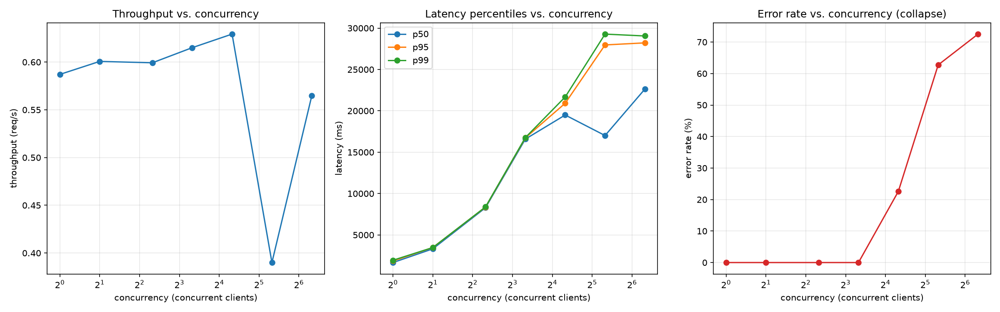
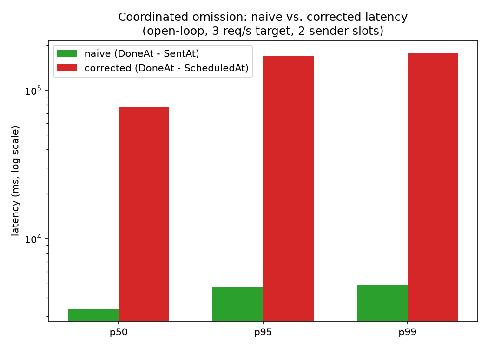

# Week 8 — Load Testing and Observability

**Phase III — Build a Production System** (Weeks 7–9)

> New to this week's vocabulary (coordinated omission, closed-loop vs. open-loop load
> generation, percentile, queueing)? See the
> [Week 8 glossary](../../docs/methodology/glossary.md#week-8--load-testing-and-observability).

## 1. What question are we investigating?

What actually happens when multiple concurrent users share one CPU-bound language
model behind the Week 7 gateway — when does throughput stop scaling, how does
latency degrade, does the system queue requests, and what resource is the real
bottleneck?

## 2. Why does the question matter?

Week 7 built the gateway and verified it works correctly for one request at a time.
Nothing about that verification says anything about what happens when 5, 20, or 80
people use it simultaneously — which is the actual production question, and the
direct prerequisite for Week 9's Kubernetes scaling and failure experiments. This
week also produces this program's first hand-rolled concurrent Go tool (rather than
reaching for an existing load-testing tool), per FULL-ROADMAP.md's explicit
educational brief.

## 3. What is the hypothesis?

See [`hypothesis.md`](hypothesis.md). Summary: throughput plateaus almost
immediately past concurrency=1 (llama-server runs with one processing slot,
`-np 1`), latency scales roughly linearly with concurrency, and errors stay near
zero until queued wait time exceeds the request timeout — at which point the error
rate should rise sharply.

## 4. What is the experimental setup?

- **System under test:** the Week 7 gateway (`services/inference-gateway`, built
  from this week's `experiments/08-load-testing/scripts/build.sh`) in front of
  llama-server (`Qwen2.5-1.5B-Instruct`, Q4_K_M — the same model/quant used
  throughout Weeks 4-6), started with `-t 2` (Week 2/3's throughput-optimal thread
  count) and **`-np 1`** (one processing slot — see `hypothesis.md` for why this is
  deliberate) and `--metrics` (llama-server's own Prometheus endpoint).
- **Load generator:** `services/load-generator` — hand-rolled in Go
  (goroutines/channels/tickers, no third-party load-testing library), built for this
  week. Two dispatch modes: **closed-loop** (N concurrent clients, each re-issuing
  immediately on completion — used for Workloads A-D) and **open-loop** (fixed
  nominal rate via a bounded sender pool — used only for the coordinated-omission
  demonstration in §9). See its own README for full design notes.
- **Prompts:** [`evaluation/datasets/v1.jsonl`](../../evaluation/datasets/v1.jsonl)
  (Weeks 4-6's 100-example dataset), cycled round-robin — realistic varied-length
  prompts rather than one fixed string repeated.
- **Observability:** Prometheus + Grafana (`infrastructure/docker/observability-compose.yml`),
  scraping the gateway's `/metrics`, llama-server's `--metrics` endpoint, and
  `node_exporter` (host CPU/RAM/load) — all three running natively on the host, only
  Prometheus/Grafana containerized. Dashboard:
  `infrastructure/grafana/dashboards/inference-gateway.json` (request rate, latency
  percentiles, errors, active/processing/deferred requests, host CPU/RAM/load, model
  throughput).
- **Code:**
  [`scripts/build.sh`](scripts/build.sh),
  [`scripts/run_workloads.sh`](scripts/run_workloads.sh) (Workloads A-D),
  [`scripts/run_coordinated_omission_demo.sh`](scripts/run_coordinated_omission_demo.sh),
  [`analysis/analyze.py`](analysis/analyze.py).

```bash
# 1. Start llama-server (from repo root):
vendor/llama.cpp/build/bin/llama-server -m models/gguf/qwen2.5-1.5b-instruct-q4_k_m.gguf \
  -t 2 -np 1 -c 2048 --no-warmup --metrics --port 8799

# 2. Build and start the gateway:
bash experiments/08-load-testing/scripts/build.sh
LLAMA_SERVER_URL=http://127.0.0.1:8799 ./experiments/08-load-testing/bin/inference-gateway

# 3. (optional) Observability stack:
vendor/node_exporter/node_exporter &
docker compose -f infrastructure/docker/observability-compose.yml up -d

# 4. Run the workloads and analyze:
bash experiments/08-load-testing/scripts/run_workloads.sh
bash experiments/08-load-testing/scripts/run_coordinated_omission_demo.sh
uv run python experiments/08-load-testing/analysis/analyze.py
```

## 5. What variables are controlled?

Model, quantization, thread count, processing slots (`-np 1`), gateway configuration
(30s request timeout, all defaults), prompt dataset, machine.

## 6. What variables are changed?

Concurrency (Workloads A/B/C: 1/5/20 fixed; Workload D: swept 1/2/5/10/20/40/80) and,
for the coordinated-omission demonstration only, dispatch mode (closed-loop vs.
open-loop).

## 7. What metrics are collected?

Per-request: latency, TTFT, tokens/sec, status/error (from the load generator, via
the gateway's own `ttft_ms`/`tokens_per_second` response fields — themselves passed
through from llama-server's `timings`). Aggregated into p50/p95/p99 latency,
throughput, and error rate per workload. Cross-checked against system-level metrics
scraped by Prometheus: `gateway_active_requests`, llama-server's
`requests_processing`/`requests_deferred`, and `node_exporter`'s per-core CPU and RAM.

## 8. What are the results?

Raw: `results/raw/08-load-testing/*.jsonl` + `*_summary.json` (11 runs: A, B, C, the
7-point D sweep, and the coordinated-omission demo). Processed:
`results/processed/08-load-testing/`. Figures:
`results/figures/08-load-testing/{saturation_sweep,coordinated_omission}.png`.

**Workloads A/B/C + D sweep:**

| concurrency | n | errors | error rate | throughput (req/s) | p50 (ms) | p95 (ms) | p99 (ms) |
|---|---|---|---|---|---|---|---|
| 1 (A) | 51 | 0 | 0% | 0.83 | 1,253 | 1,541 | 1,658 |
| 5 (B) | 58 | 0 | 0% | 0.84 | 5,847 | 8,379 | 9,459 |
| 20 (C) | 64 | 12 | 18.8% | 0.58 | 26,127 | 28,180 | 28,756 |
| 1 (D) | 12 | 0 | 0% | 0.59 | 1,660 | 1,850 | 1,938 |
| 2 (D) | 13 | 0 | 0% | 0.60 | 3,319 | 3,474 | 3,476 |
| 5 (D) | 16 | 0 | 0% | 0.60 | 8,287 | 8,373 | 8,384 |
| 10 (D) | 21 | 0 | 0% | 0.62 | 16,585 | 16,733 | 16,768 |
| 20 (D) | 31 | 7 | 22.6% | 0.63 | 19,495 | 20,918 | 21,676 |
| 40 (D) | 51 | 32 | 62.7% | 0.39 | 17,014 | 27,967 | 29,277 |
| 80 (D) | 91 | 66 | 72.5% | 0.56 | 22,632 | 28,217 | 29,050 |

**Prometheus-observed peaks during the sweep:** `requests_processing` never exceeded
**1**; `requests_deferred` peaked at **78** (during the concurrency=80 run).
Per-core host CPU during saturation (concurrency=20 and 80 windows): one core at
**96-98%**, a second at **54-64%**, the remaining 8 cores under 32%.



**Coordinated omission demonstration** (open-loop, 3 req/s target, 2 sender slots,
45s nominal duration — actual wall clock 224s, see §9):

| | naive (DoneAt−SentAt) | corrected (DoneAt−ScheduledAt) |
|---|---|---|
| p50 | 3,395 ms | **77,455 ms** |
| p95 | 4,738 ms | **171,537 ms** |
| p99 | 4,895 ms | **177,536 ms** |



## 9. How should the results be interpreted?

**The central hypothesis holds: throughput never scales with concurrency, because
llama-server's single processing slot (`-np 1`) is a hard serialization point.**
Throughput is essentially flat — 0.58 to 0.65 req/s — across every concurrency level
from 1 to 20, confirmed directly (not just inferred) by `requests_processing` never
exceeding 1 in Prometheus. **Concurrency beyond 1 buys queueing, not throughput.**
The two apparent throughput "drops" at concurrency 40 (0.39 req/s) and partial
recovery at 80 (0.56 req/s) are a measurement artifact, not real system behavior: at
extreme concurrency most requests time out entirely (62.7% and 72.5% error rates)
and are excluded from the throughput calculation entirely — throughput here only
counts *successful* completions, so a huge batch of concurrent attempts with a high
failure rate can still produce a similar or higher raw count of successes than a
smaller, cleaner batch, without the system actually working any faster.

**Latency scales almost exactly linearly with concurrency up to the point where
timeouts start firing** — 1,253ms → 3,319ms → 8,287ms → 16,585ms → 19,495ms for
concurrency 1/2/5/10/20, consistent with a single-server queue where each new
client waits behind roughly N−1 others already in line. **Beyond concurrency 20,
p50 latency becomes an unreliable, survivorship-biased number**: it drops to
17,014ms at concurrency 40 not because the system got faster, but because the
slowest ~63% of requests timed out and were excluded from the *successful*-request
latency calculation entirely — only the "lucky" requests that happened to queue
behind fewer others are left to compute a percentile from. p95/p99, by contrast,
climb to ~28-29 seconds and *stay* there through concurrency 40 and 80 — because
those percentiles are dominated by requests that nearly-but-not-quite avoided the
30-second timeout, meaning **p99 latency past saturation isn't measuring true
system slowness, it's measuring the timeout ceiling itself.**

**The error rate curve is this week's cleanest "collapse" signal**: 0% through
concurrency 10, rising to 18.8-22.6% at concurrency 20, then 62.7% at 40 and 72.5%
at 80 — every single error was a request or gateway timeout (504 from the gateway,
or the load generator's own client-side deadline), confirmed by inspecting the raw
error strings. The collapse point (between concurrency 10 and 20 on this machine,
with this 30-second timeout) is exactly where median queued wait time first starts
approaching the timeout — a directly falsifiable, reproducible prediction from the
single-queue model, not just an empirical curve-fit.

**Yes, the system queues requests — quantitatively, not just inferentially.**
llama-server's own `requests_deferred` metric peaked at 78 during the concurrency=80
run, meaning close to every one of those 80 concurrent client requests was sitting
in an explicit queue at some point, waiting for the one available processing slot.

**CPU does reach 100% — but only on the cores this configuration actually assigns to
the model, not system-wide**, directly echoing Week 3's thread-scaling findings on
this same machine. During saturation, one core sustained 96-98% and a second 54-64%,
while the other 8 cores (of this 10-core Apple M4) stayed under 32%. **The
bottleneck is not "the CPU" in an undifferentiated sense — it's the single
processing slot's serialized use of the 2 threads Week 2/3 already established as
this machine's throughput-optimal setting.** A bigger machine wouldn't help unless it
changed what `-np`/`-t` are configured to use; more processing slots
(`--parallel N > 1`, enabling llama-server's continuous batching across requests)
is the more direct lever — untested this week, see §11.

**The coordinated omission demonstration is the most dramatic single result this
week produces.** At a nominal 3 requests/sec against a backend that takes 1-5
seconds per request with only 2 sender slots, naive latency (measuring only from
actual dispatch time) reports an unremarkable p50 of 3.4 seconds — while the
corrected latency (measuring from the *nominal* scheduled time, i.e. what a real
constant-rate-arriving user population would actually experience) is **77.5 seconds
at p50 and 177.5 seconds at p99** — roughly 20-36x higher. The demo's actual wall-clock
runtime (224 seconds) also vastly exceeded its nominal 45-second duration, because
every one of the 135 nominally-scheduled requests was eventually dispatched and
completed rather than dropped — the backlog didn't disappear when the clock ran out,
it just kept draining. This is coordinated omission made concrete: **a load
generator that only measures what it actually sent, not what it meant to send,
systematically hides exactly the tail-latency blowup that matters most.**

## 10. What are the limitations?

- **Each D-sweep level ran for only 20 seconds** (vs. 60s for A/B/C), producing as
  few as 12-13 samples at the low-concurrency end — workload_a (60s, n=51) and
  workload_d_c1 (20s, n=12, same concurrency=1 configuration) disagree on throughput
  by ~30% (0.83 vs. 0.59 req/s), which is very plausibly just small-sample noise, not
  a real difference — the D-sweep's shape (plateau, then collapse) is robust to this,
  but individual point estimates at low concurrency shouldn't be over-trusted.
- **`-np 1` is a deliberate simplification, not the only reasonable production
  configuration** — see `hypothesis.md`. Whether `--parallel N > 1` (continuous
  batching across concurrent requests) changes the throughput ceiling is a direct,
  unanswered follow-up.
- **The 30-second request timeout is a chosen configuration value, not a law of
  nature** — the exact concurrency level at which errors start appearing is
  timeout-dependent; a longer timeout would push the collapse point further out
  (at the cost of every client waiting longer) rather than eliminate it, since the
  underlying single-slot bottleneck is unchanged.
- **The coordinated omission demo used one arbitrary (rate, sender-slots) pair**
  (3 req/s, 2 slots) chosen to be dramatic and reproducible-in-a-single-run, not
  swept — a fuller characterization would vary both independently.
- **Single model, single machine, single quantization level** — as with every prior
  week, whether this exact collapse curve (in particular, the concurrency 10→20
  cliff) generalizes to a different model, machine, or quantization is untested;
  directly relevant to Week 9's Kubernetes scaling work.

## 11. What new questions emerged?

- Does `--parallel N > 1` (continuous batching) raise the throughput ceiling
  observed here, or does CPU contention between batched requests limit the gain?
- Where exactly does the concurrency 10→20 collapse point move if the request
  timeout is doubled or halved — does it shift linearly, confirming the single-queue
  model, or does something else change?
- Would a longer D-sweep (more samples per level) tighten the workload_a vs.
  workload_d_c1 throughput discrepancy noted in limitations, or reveal it as a real
  effect (e.g. some form of warm-up)?
- How does this collapse curve change once Week 9 puts the gateway behind
  Kubernetes with multiple replicas — does horizontal scaling actually raise the
  throughput ceiling the way `--parallel` might, or does it just move the
  bottleneck to a shared resource (e.g. this machine's CPU cores) faster?

All open questions, from every week, are tracked in
[`docs/methodology/open-questions.md`](../../docs/methodology/open-questions.md),
which this week updates with four new entries.
