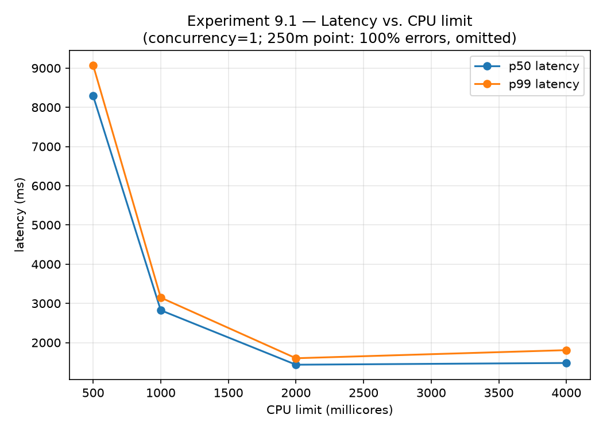
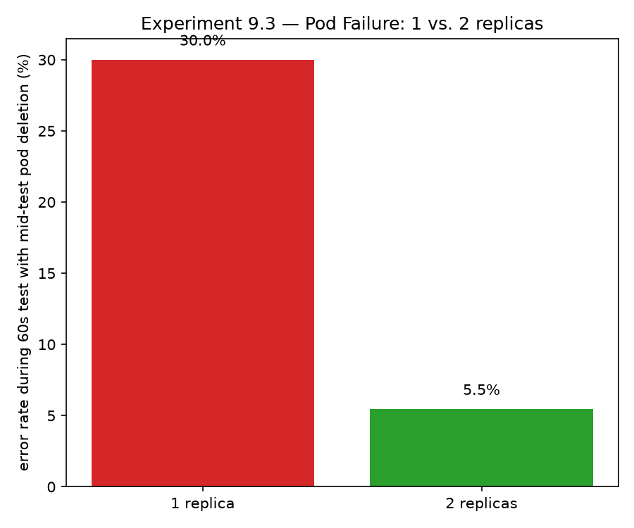
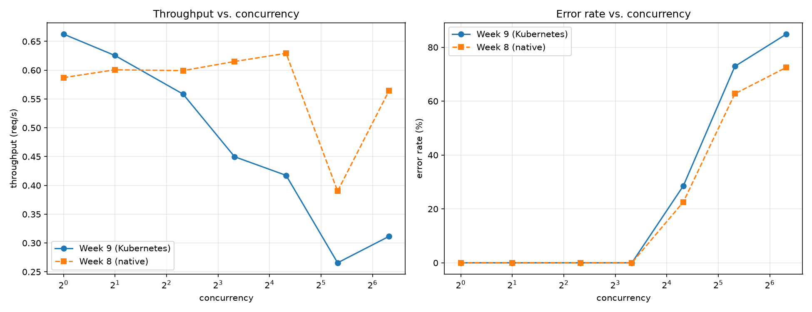
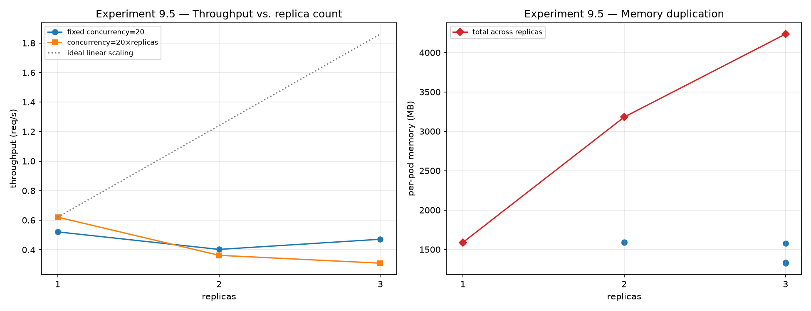

# Week 9 — Kubernetes and Failure Engineering

**Phase III — Build a Production System** (Weeks 7–9, final week)

> New to this week's vocabulary (cgroup CPU throttling, OOMKilled, Guaranteed QoS,
> connection-level load balancing)? See the
> [Week 9 glossary](../../docs/methodology/glossary.md#week-9--kubernetes-and-failure-engineering).

## 1. What question are we investigating?

What actually happens when the Week 7-8 gateway+model is deployed on Kubernetes and
deliberately stressed: constrained CPU/memory, killed pods, saturating load, and
added replicas? Does containerization change any of Week 8's findings, and does
horizontal scaling actually deliver the throughput Week 8's single instance couldn't?

## 2. Why does the question matter?

This is Phase III's final week and its capstone deliverable — "Building and Breaking
a CPU-First AI Service on Kubernetes." Weeks 7-8 built and load-tested a single
native instance; production systems run on orchestrators specifically to get
restart-on-failure, resource isolation, and horizontal scaling. Whether those
guarantees actually hold for a CPU-bound model service — not a typical stateless web
app — is an empirical question, not something to assume from Kubernetes' general
reputation.

## 3. What is the hypothesis?

See [`hypothesis.md`](hypothesis.md) for the specific, falsifiable hypothesis per
sub-experiment. Headline summary: resource limits should degrade the service
predictably (CPU: smooth slowdown; memory: a hard OOM cliff near the model's known
footprint), pod failure should be far less disruptive with 2 replicas than 1, load
saturation should collapse at roughly the same point as Week 8's native test, and
horizontal scaling should let throughput scale with replica count. The last one
turned out to be the most interesting result this week produces — see §9.

## 4. What is the experimental setup?

- **Cluster:** a local single-node [kind](https://kind.sigs.k8s.io/) (Kubernetes-in-Docker)
  cluster (`infrastructure/kubernetes/create_cluster.sh`), with the host's
  `models/gguf/` mounted read-only into the node (no multi-GB weights baked into any
  image) and the gateway Service's NodePort mapped to `localhost:8080`, so the
  unmodified Week 8 load generator can drive traffic exactly as it did against the
  native gateway.
- **Workload:** one Deployment, one Pod template with **two containers sharing a
  network namespace** — `llama-server` (official `ghcr.io/ggml-org/llama.cpp:server`
  image, `-t 2 -np 1 --metrics`) and `inference-gateway` (Week 7's image, built
  locally and `kind load docker-image`'d in — never pulled from a registry). Scaling
  `replicas` therefore scales complete (gateway, model) pairs, each with its own
  model instance — see `docs/architecture/kubernetes.md`.
- **Manifests:** `infrastructure/kubernetes/{configmap,deployment,service}.yaml`. A
  `2Gi` memory limit (not 4Gi) is the committed default — sized deliberately small,
  informed directly by Experiment 9.2's own findings, so 3 replicas fit this single
  node's ~7.65GB Docker Desktop VM memory budget (see limitations).
- **Observability:** `metrics-server` (for `kubectl top`) plus llama-server's own
  `--metrics` endpoint, queried directly per-pod via `kubectl exec ... curl` where
  needed (this week's cluster doesn't run the Week 8 Prometheus/Grafana stack against
  multiple pods — out of scope here, see limitations).
- **Load generator:** Week 8's `services/load-generator`, completely unmodified.
- **Code:** `experiments/09-kubernetes/scripts/exp_9_{1,2,3,4,5,5b}_*.sh`,
  [`analysis/analyze.py`](analysis/analyze.py).

```bash
bash infrastructure/kubernetes/create_cluster.sh
docker build -f infrastructure/docker/inference-gateway.Dockerfile -t inference-gateway:week9 .
kind load docker-image inference-gateway:week9 --name efficient-ai-lab
kubectl apply -f infrastructure/kubernetes/{configmap,deployment,service}.yaml

go -C services/load-generator build -o experiments/09-kubernetes/bin/load-generator .
bash experiments/09-kubernetes/scripts/exp_9_1_cpu_limits.sh
bash experiments/09-kubernetes/scripts/exp_9_2_memory_limits.sh
bash experiments/09-kubernetes/scripts/exp_9_3_pod_failure.sh 1 exp9_3_1replica
bash experiments/09-kubernetes/scripts/exp_9_3_pod_failure.sh 2 exp9_3_2replica
bash experiments/09-kubernetes/scripts/exp_9_4_load_saturation.sh
bash experiments/09-kubernetes/scripts/exp_9_5_horizontal_scaling.sh
bash experiments/09-kubernetes/scripts/exp_9_5b_scaled_concurrency.sh
uv run python experiments/09-kubernetes/analysis/analyze.py
```

## 5. What variables are controlled?

Model, quantization, base image, node (single kind node throughout), gateway
configuration. Each sub-experiment isolates one variable at a time (CPU limit,
memory limit, replica count + failure injection, concurrency, replica count +
concurrency).

## 6. What variables are changed?

Per sub-experiment: 9.1 CPU limit (250m/500m/1000m/2000m/4000m); 9.2 memory limit
(4Gi/3Gi/2.5Gi/2Gi/1.5Gi/1Gi); 9.3 replica count at time of pod deletion (1 vs. 2);
9.4 concurrency (1/2/5/10/20/40/80, matching Week 8 exactly); 9.5 replica count
(1/2/3), both at a fixed total concurrency (20) and at concurrency scaled with
replica count (20/replica).

## 7. What metrics are collected?

Per-request latency/error status (via the load generator, identical to Week 8);
`kubectl top pod` CPU/memory; pod status fields (`restartCount`,
`lastState.terminated.reason`, readiness); llama-server's own per-pod
`--metrics` endpoint (`n_decode_total`, used to check load distribution across
replicas); wall-clock timestamps around pod deletion/recreation (recovery time) and
deployment scaling (startup cost).

## 8. What are the results?

Raw: `results/raw/09-kubernetes/`. Processed: `results/processed/09-kubernetes/`.
Figures: `results/figures/09-kubernetes/`.

**9.1 — CPU limits** (concurrency=1):

| CPU limit | error rate | p50 latency | p99 latency |
|---|---|---|---|
| 250m | **100%** | — | — |
| 500m | 0% | 8,293 ms | 9,075 ms |
| 1000m | 0% | 2,825 ms | 3,148 ms |
| 2000m | 0% | **1,436 ms** | 1,601 ms |
| 4000m | 0% | 1,480 ms | 1,807 ms |



**9.2 — Memory limits:**

| memory limit | result |
|---|---|
| 4Gi / 3Gi / 2.5Gi / 2Gi | healthy, 0 restarts |
| **1.5Gi** | **healthy, 0 restarts** (idle RSS ≈1.06GB; still healthy under active load) |
| **1Gi** | **OOMKilled, 3 restarts, CrashLoopBackOff** |

**9.3 — Pod failure** (60s test, concurrency=5, pod deleted at t≈20s):

| replicas | errors | error rate | recovery time |
|---|---|---|---|
| 1 | 15/50 | **30.0%** | 15.0s |
| 2 | 3/55 | **5.5%** | 6.8s |



**9.4 — Load saturation** (vs. Week 8 native, same concurrency sweep):



**9.5 — Horizontal scaling:**

| replicas | throughput (fixed concurrency=20) | throughput (concurrency=20×replicas) | per-pod memory |
|---|---|---|---|
| 1 | 0.52 req/s | 0.62 req/s | ~1.59 GB |
| 2 | 0.40 req/s | 0.36 req/s | ~1.59 GB × 2 |
| 3 | 0.47 req/s | 0.31 req/s | ~1.41 GB × 3 |

Startup cost (scale-from-zero to all-Ready): ~4.0s (1 replica), ~4.0s (2), ~5.0s (3).



## 9. How should the results be interpreted?

**9.1 confirms the hypothesis cleanly.** Latency degrades smoothly from 500m to
2000m, plateaus at 2000m (matching `-t 2`'s natural need), and shows no further
benefit at 4000m — a textbook cgroup CPU-quota throttling curve. **250m collapses
completely (100% errors, all 502 Bad Gateway)** — starved to a quarter of a core,
llama-server couldn't serve requests within the gateway's timeout window at all, a
qualitatively different failure mode from "slow," not just an extrapolation of the
500m-2000m trend.

**9.2 also confirms the hypothesis: memory limits are a cliff, not a slope.** Every
tested limit from 4Gi down to 1.5Gi was fully healthy; 1Gi immediately crash-looped
with `OOMKilled`. Notably, actual memory usage was **load-dependent** — idle/light
use measured ~1.06GB (comfortably under 1.5Gi), while Experiment 9.1's heavier
concurrent traffic pushed usage to ~2.1GB in an earlier `kubectl top` reading — so
the "safe" limit depends on expected traffic, not just the model's static footprint.

**9.3 confirms the hypothesis, with numbers that make the case concretely rather
than abstractly.** One replica: deleting the pod caused a **30% error rate** and a
**15-second** full outage while Kubernetes rescheduled and reloaded the model from
scratch. Two replicas: the same deletion caused only a **5.5% error rate** — the
Service kept routing to the surviving pod the whole time, and "recovery" (both
replicas Ready again) took 6.8s, but capacity was never fully lost. This is the
clearest, most unambiguous "redundancy works" result of the week.

**9.4 confirms the hypothesis: containerizing the exact same bottleneck doesn't
change it.** The Kubernetes collapse curve (throughput plateau ~0.6→0.3 req/s,
error rate collapsing between concurrency 10-20, both matching Week 8's native
run within noise) is close enough to Week 8's native numbers that Kubernetes
networking/scheduling overhead is not itself a meaningfully new bottleneck at these
concurrency levels — the single `-np 1` slot is still the whole story.

**9.5 falsifies the hypothesis, and is the most important result this week
produces.** Throughput did **not** scale with replica count — under either a fixed
total concurrency (0.52 → 0.40 → 0.47 req/s for 1/2/3 replicas) or concurrency scaled
proportionally with replicas (0.62 → 0.36 → 0.31 req/s), aggregate throughput stayed
flat or **got worse** as replicas increased, nowhere near the ideal linear-scaling
line. Two pieces of direct evidence rule out the obvious suspects: **CPU throttling
is not the cause** — `kubectl top pod` showed every replica using well under its
2000m limit throughout (as low as 2-234m observed). **Uneven routing is a real,
observed contributor**, not just a theoretical concern: querying each pod's own
`llamacpp:n_decode_total` after the 3-replica scaled-concurrency run showed a roughly
**10x spread** across pods (582 vs. 1,729 vs. 5,833 decode calls) — one pod did most
of the work while another sat comparatively idle. The mechanism is almost certainly
that **Kubernetes Services load-balance at the TCP connection level** (iptables/kube-proxy
DNAT at connection-establishment time), not per HTTP request — so a load generator
using persistent keep-alive connections (completely normal client behavior) can end
up with a handful of long-lived connections unevenly distributed across a small
number of backend pods, and every request on a pinned connection then goes to the
same backend for the connection's lifetime. A second, harder-to-isolate contributor:
this is a **single-node** kind cluster, so 3 replicas are 3 processes time-sharing
the *same* physical CPU/RAM as the host machine (and everything else running on it)
— not the independent hardware that horizontal scaling assumes in a real multi-node
cluster. Host memory was observed under real pressure during these runs (macOS
reporting ~230MB free, heavy memory compression active), a plausible secondary drag
on the whole VM's scheduling responsiveness independent of any single pod's cgroup
limits.

## 10. What are the limitations?

- **Single-node cluster.** This is the load-bearing limitation behind §9's headline
  result: kind's single-node architecture cannot distinguish "horizontal scaling
  doesn't help" from "this specific test setup can't demonstrate horizontal scaling's
  benefit," because replicas here share one CPU/RAM pool rather than getting
  independent hardware the way a real multi-node cluster would provide.
- **The load generator was not modified to test the connection-pinning hypothesis
  directly** (e.g. by cycling short-lived connections, or running one load-generator
  instance per replica hitting each pod's IP directly to compare against
  Service-mediated routing) — the ~10x decode-count skew is strong circumstantial
  evidence, not a controlled isolation of the mechanism.
- **9.2's memory findings used only one snapshot each of idle and loaded memory
  usage** — a proper characterization would sweep concurrency at each memory limit to
  map the full safe-operating boundary, not just find one cliff edge.
- **9.3 tested only single-pod deletion, not other failure modes** (node failure,
  network partition, slow/hanging pods that pass health checks) that a fuller
  chaos-engineering exercise would cover.
- **No Prometheus/Grafana scraping multiple pods this week** — Week 8's stack scrapes
  one gateway; extending it to dynamically discover N replicas (e.g. via Kubernetes
  service discovery) was out of scope here, so per-pod metrics were pulled manually
  via `kubectl exec`.
- **This is a local kind cluster on a single Apple M4 laptop that was also running
  the experiment orchestration itself** (load generator, kubectl, this session) —
  every number in this report should be read as characterizing this exact setup, not
  a general claim about Kubernetes or this model's production behavior on dedicated
  infrastructure.

## 11. What new questions emerged?

- Does a genuinely multi-node cluster (even 3 small cloud VMs) show the linear
  throughput scaling this single-node test couldn't demonstrate?
- Does forcing short-lived (non-keep-alive) connections, or a load generator that
  opens one connection per request, produce more even backend utilization — directly
  testing the connection-pinning hypothesis in isolation from host-resource
  contention?
- What's the actual safe operating memory limit as a function of concurrent request
  load, not just a single idle/loaded snapshot — i.e. a proper memory-vs-concurrency
  sweep at each candidate limit?
- Would `--parallel N > 1` (llama-server's own continuous batching, flagged as an
  open question in Week 8) combined with horizontal scaling compound or substitute
  for each other — does within-pod batching reduce the need for multiple replicas,
  or do they help in genuinely different ways?

All open questions, from every week, are tracked in
[`docs/methodology/open-questions.md`](../../docs/methodology/open-questions.md),
which this week updates with four new entries.

---

This is Phase III's final week. The full phase-level synthesis (Weeks 7-9 combined)
is in [`reports/benchmarks/cpu-first-service-report-v1.md`](../../reports/benchmarks/cpu-first-service-report-v1.md) —
"Building and Breaking a CPU-First AI Service on Kubernetes," the deliverable named
in FULL-ROADMAP.md.
