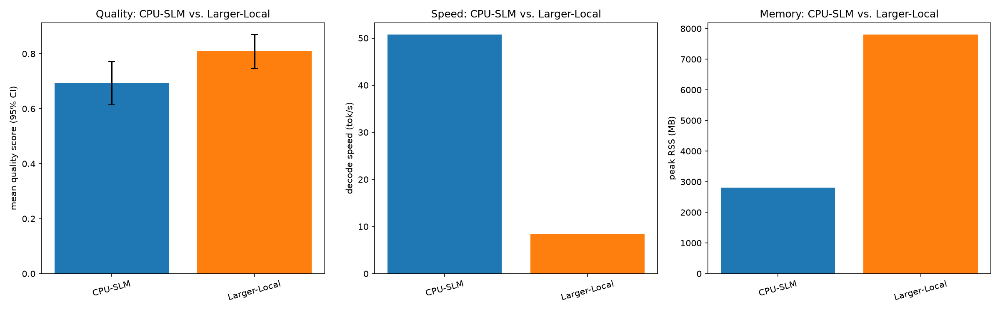
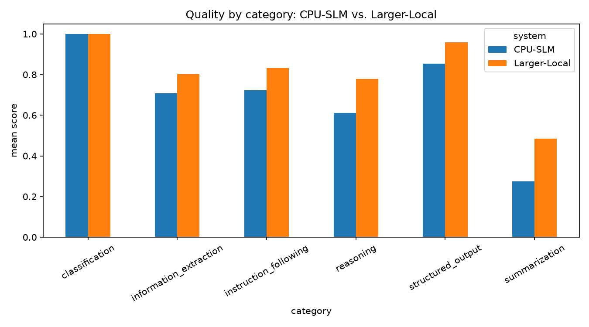

# Week 10 — SLM vs LLM

**Phase IV — Synthesize and Decide** (Weeks 10–12, start)

> New to this week's vocabulary (paired effect size, cost model, qualitative
> dimension)? See the
> [Week 10 glossary](../../docs/methodology/glossary.md#week-10--slm-vs-llm).

## 1. What question are we investigating?

**Not** "which is the best model" — per FULL-ROADMAP.md's explicit framing, the
question is **under which constraints does each architecture (small self-hosted
model, larger self-hosted model, frontier remote API) become the preferable choice**,
across quality, latency, throughput, cost, privacy, operational complexity,
deployment complexity, observability, and failure modes.

## 2. Why does the question matter?

Weeks 1-9 built deep, quantitative expertise on *one* architecture (a small,
quantized, self-hosted, CPU-only model) without ever asking whether that was the
right choice to begin with. Phase IV's whole purpose is stepping back to ask that
question directly, using everything Phases I-III measured (quantization cost/quality
trade-offs from Weeks 4-6, the production-service reality of Weeks 7-9) as inputs to
a genuine architecture decision rather than assuming the CPU-SLM approach was
self-evidently correct.

## 3. What is the hypothesis?

See [`hypothesis.md`](hypothesis.md). Summary: the larger self-hosted model should
score higher on quality than the CPU-SLM at a real, measurable cost in latency,
throughput, and memory — quantifying the actual size of that trade-off rather than
assuming it. The frontier system's quality/latency/throughput are **not measured
live this week** (see §4); its other dimensions are assessed qualitatively.

## 4. What is the experimental setup?

- **Systems compared:**

  | system | what | measured how |
  |---|---|---|
  | **CPU-SLM** | `Qwen2.5-1.5B-Instruct`, Q4_K_M | live, via this program's standard evaluation pipeline |
  | **Larger-Local** | `Qwen2.5-7B-Instruct`, Q4_K_M (~4.7x the params, same family) | live, same pipeline |
  | **Frontier-API** | a remote frontier model | **not called live** — see below |

- **Why the frontier system isn't measured live:** calling a real frontier API
  costs real money and needs real credentials this session shouldn't source for
  itself. Rather than fabricate plausible-looking quality/latency numbers, this week
  builds the full comparison framework (dataset, scorers, cost model) so a frontier
  backend could be added later by pointing `evaluation/runners/` at it and
  re-running `analysis/` — and is explicit everywhere (config comments, script
  docstrings, this README) about exactly what is measured vs. documented vs.
  templated. Its cost is estimated from illustrative (not verified current) per-token
  price placeholders; its privacy/operational/deployment/observability/failure-mode
  characteristics are assessed qualitatively in §9.
- **Dataset:** [`evaluation/datasets/v1.jsonl`](../../evaluation/datasets/v1.jsonl)
  (Weeks 4-6's 100-example, 6-category, 2-language dataset) — reused rather than
  building a new one; it already covers 6 of the roadmap's example task types
  (classification, information extraction, structured JSON, summarization,
  reasoning, instruction following, Italian-language processing), though not
  "document routing" or "domain-specific Q&A" specifically (see limitations).
- **Pipeline:** identical to Weeks 5/6/8 — `evaluation/runners/llama_server_runner.py`,
  `evaluation/prompts/templates.py`, `evaluation/metrics/scorers.py`, all reused
  unmodified. Speed/memory benchmark reuses Week 2's `run_llama_cli` (Week 4/6-style).
- **Cost model:** [`analysis/cost_model.py`](analysis/cost_model.py) — local cost is
  measured generation time × an hourly compute-cost placeholder; frontier cost is
  this week's own measured token counts × per-token price placeholders. See its
  module docstring for exactly what's measured vs. illustrative.
- **Code:** [`scripts/system_benchmark.py`](scripts/system_benchmark.py),
  [`scripts/run_evaluation.py`](scripts/run_evaluation.py),
  [`analysis/score.py`](analysis/score.py), [`analysis/analyze.py`](analysis/analyze.py),
  [`analysis/cost_model.py`](analysis/cost_model.py).
- **Config:** [`config/model.yaml`](config/model.yaml).

```bash
uv run python experiments/10-slm-vs-llm/scripts/system_benchmark.py
uv run python experiments/10-slm-vs-llm/scripts/run_evaluation.py
uv run python experiments/10-slm-vs-llm/analysis/score.py
uv run python experiments/10-slm-vs-llm/analysis/analyze.py
uv run python experiments/10-slm-vs-llm/analysis/cost_model.py
```

## 5. What variables are controlled?

Hardware, thread count (2, Week 2/3's throughput-optimal setting), context size,
quantization format (Q4_K_M for both local systems), dataset, decoding parameters
(temperature 0, fixed seed), prompt template.

## 6. What variables are changed?

System: CPU-SLM vs. Larger-Local (quality/speed/memory/cost, measured); all three
systems (qualitative dimensions, documented).

## 7. What metrics are collected?

Quality (per-example score via the shared scorers, bootstrap 95% CI, paired
effect size between the two measured systems), latency (TTFT, total time),
throughput (decode tok/s), memory (peak RSS), disk size, load time, and
cost-per-request (measured for the 2 local systems, illustrative-price-based for
the frontier system) — plus, only for the frontier system, a qualitative assessment
of privacy, operational complexity, deployment complexity, observability, and
failure modes (§9).

## 8. What are the results?

Raw: `results/raw/10-slm-vs-llm/{raw_outputs.jsonl,system_benchmark.csv}`.
Processed: `results/processed/10-slm-vs-llm/`. Figures:
`results/figures/10-slm-vs-llm/`.

**Quality, speed, memory:**

| system | mean quality (95% CI) | decode (tok/s) | peak RSS | load time | disk size |
|---|---|---|---|---|---|
| CPU-SLM | 0.694 [0.614, 0.772] | **50.7** | **2,802 MB** | **0.93s** | **1,066 MB** |
| Larger-Local | **0.809** [0.746, 0.870] | 8.5 | 7,803 MB | 11.43s | 4,466 MB |

Paired effect size (same 100 examples, Larger-Local − CPU-SLM): **+0.115**
(Cohen's dz = 0.37, 95% CI [0.057, 0.178] — excludes 0).



**Quality by category:**

| category | CPU-SLM | Larger-Local |
|---|---|---|
| classification | 1.000 | 1.000 |
| structured_output | 0.854 | 0.958 |
| instruction_following | 0.722 | 0.833 |
| information_extraction | 0.708 | 0.802 |
| reasoning | 0.611 | 0.778 |
| summarization | 0.275 | **0.486** |



**Quality by language:** CPU-SLM: 0.787 (EN) / 0.601 (IT), gap 0.186. Larger-Local:
0.858 (EN) / 0.760 (IT), gap **0.098** — roughly half.

**JSON validity:** 100% for both systems (32/32 structured-output examples each).

**Cost per request (illustrative price constants — see `cost_model.py`):**

| system | cost / request | cost / 1,000 requests |
|---|---|---|
| CPU-SLM | $0.000029 | $0.029 |
| Larger-Local | $0.000126 | $0.126 |
| Frontier-API (documented, not measured) | $0.000217 | $0.217 |

## 9. How should the results be interpreted?

**The central hypothesis holds, with a statistically real (not just visually
suggestive) quality gain.** Larger-Local outscores CPU-SLM by +0.115 (paired,
same 100 examples), and the paired bootstrap CI on that difference ([0.057, 0.178])
excludes zero — this isn't noise. The gain is not uniform: **flat at the
classification ceiling** (both saturate at 1.000, echoing Week 6), but real and
substantial everywhere else — largest in **summarization** (+0.211) and
**reasoning** (+0.167), the two categories that most plausibly benefit from more
model capacity (synthesizing/condensing text, multi-step arithmetic) rather than
pattern-matching a closed answer set.

**That quality gain costs roughly 6x the decode speed, 12x the load time, and 2.8x
the peak memory** — a real, measurable trade-off, not a free upgrade. At
concurrency 1 with this machine's fixed 2-thread budget, Larger-Local's 8.5 tok/s
means noticeably longer per-request latency, and its 11.4-second load time (vs.
CPU-SLM's 0.93s) makes cold-start-sensitive deployments (e.g. scale-to-zero, per
Week 9's startup-cost finding) considerably less attractive.

**Multilingual capability improves *and* the EN-IT gap narrows with more capacity**
— both real findings, not the same one restated: Larger-Local is better in Italian
in absolute terms (0.760 vs. 0.601) *and* proportionally closer to its own English
performance (a 0.098 gap vs. CPU-SLM's 0.186) — weak evidence that more capacity
disproportionately helps the harder-for-this-model-family language, though one
dataset and one family isn't enough to generalize this claim (see limitations).

**On the illustrative cost model, self-hosting is cheaper per request than the
frontier placeholder — but this number is only as good as its price constants,
which are not verified.** CPU-SLM ($0.029/1k requests) and Larger-Local
($0.126/1k) both undercut the frontier placeholder ($0.217/1k) at the price
constants in `config/model.yaml`. This ordering is **not a claim about real
frontier API economics** — it would flip immediately under different (very
plausible) constants, e.g. a cheaper frontier model or a more expensive local
compute reference. The actually load-bearing part of this result is the *formula*
and the *measured* local-system numbers (real generation times, real token counts),
which remain valid regardless of which price constants get substituted in.

**Answering the roadmap's real question — under which constraints does each
architecture win:**

- **CPU-SLM wins on latency, throughput, memory, and (on this illustrative model)
  cost** — the right choice when requests must be fast, concurrent, or run on
  constrained hardware, and quality above the CPU-SLM's level isn't required.
- **Larger-Local wins on quality**, especially for summarization/reasoning-heavy
  workloads and Italian-language content — the right choice when a self-hosted
  deployment is required (privacy, no internet dependency, no per-token billing)
  and the hardware/latency budget can absorb a ~6x slowdown.
- **Frontier-API's real advantages are dimensions this week didn't measure
  numerically but can state confidently from how it works**: zero deployment
  complexity (an API key vs. Weeks 2-9's entire self-hosting stack), someone else's
  infrastructure absorbing operational failure modes (Week 9's OOM/CPU-throttling/pod-
  eviction concerns become the provider's problem, not yours), and near-certainly
  higher raw quality than either self-hosted system here (frontier models are
  larger and more heavily trained than a 7B open model) — at the cost of data
  leaving the premises (a categorical, not incremental, privacy difference) and
  per-token billing that scales with usage rather than being front-loaded into
  hardware.

## 10. What are the limitations?

- **The frontier system was never actually called.** Its cost is a formula applied
  to illustrative price constants, not a verified number; its quality/latency/
  throughput are not claimed at all. Anyone using this report to make a real
  decision should re-run `analysis/cost_model.py` with current, verified pricing for
  their actual candidate provider, and ideally add a live frontier run using the
  same dataset and scorers.
- **The speed/memory benchmark shows a within-run downward drift in decode speed for
  both systems** (e.g. CPU-SLM: 62.8 tok/s on the first repetition, stabilizing
  around 48-50 by the tenth), consistent with the thermal effects Weeks 2-3 already
  documented on this machine — and because CPU-SLM's benchmark always runs *before*
  Larger-Local's in the same script invocation, Larger-Local's numbers may reflect a
  warmer starting thermal state than CPU-SLM's. The reported means average over this
  drift rather than isolating a single steady-state value.
- **Same family, not an architecture-diverse comparison.** Both local systems are
  Qwen2.5 — cleanly isolates "parameter count" as the variable (as intended), but
  says nothing about whether a different architecture at 7B would show the same
  quality gain, the same category pattern, or the same narrowing EN-IT gap.
- **Dataset covers 6 of the roadmap's ~8 example task types** — no document-routing
  or domain-specific Q&A examples, so this comparison's category-level findings
  (e.g. "biggest gains in summarization/reasoning") may not generalize to those
  untested task types.
- **Thread count (2) and context size (2048) were held constant across both local
  systems for a clean size comparison** — a real deployment of the 7B model would
  likely tune threads differently, so Larger-Local's absolute speed numbers here are
  a controlled-comparison artifact, not necessarily this model's best achievable
  speed on this hardware.

## 11. What new questions emerged?

- Would a live frontier-API run (using this exact dataset and scorers) put the
  frontier system's quality above, at, or only modestly above Larger-Local's — i.e.
  is the "frontier premium" over a 7B open model large or small in practice?
- Does the EN-IT gap continue narrowing at even larger local model sizes, or does it
  plateau (or reverse) at some point — a question only a 3-point-or-more model-size
  sweep could answer?
- At what request-volume/latency-tolerance combination does Larger-Local's quality
  gain justify its ~6x speed cost in a real product decision — i.e. where exactly is
  the crossover this week's data hints at but doesn't pin down?
- Would an architecturally different ~7B model (not same-family as the CPU-SLM)
  show the same category-level quality pattern (biggest gains in
  summarization/reasoning), or is that specific to how Qwen2.5 scales within its own
  family?

All open questions, from every week, are tracked in
[`docs/methodology/open-questions.md`](../../docs/methodology/open-questions.md),
which this week updates with four new entries.
