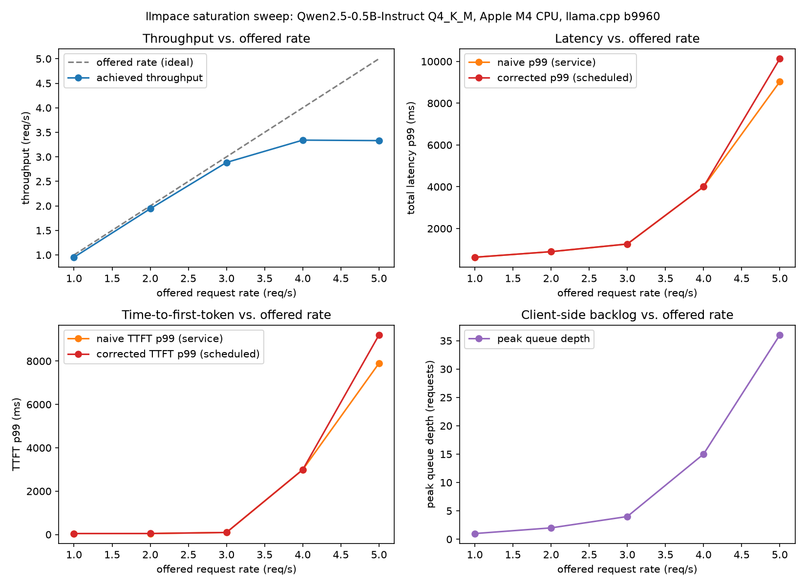

# llmpace

[](https://github.com/alessandrobessi/efficient-ai-lab/actions/workflows/llmpace-ci.yml)

A small, inspectable, dependency-free Go load generator for LLM inference
servers that makes **scheduled-vs-service latency** impossible to overlook —
one static binary, stdlib only, no Python environment required.

**Status: [`llmpace/v0.1.1`](https://github.com/alessandrobessi/efficient-ai-lab/tree/llmpace/v0.1.1) tagged.**
No pre-built binaries published yet — build from source (below). See
[`ROADMAP.md`](ROADMAP.md) for full design rationale and [Known
limitations](#known-limitations) for what's still open.

## Table of contents

- [Why this matters](#why-this-matters)
- [Why ordinary latency lies under saturation](#why-ordinary-latency-lies-under-saturation)
- [30-second demo](#30-second-demo)
- [A real saturation curve](#a-real-saturation-curve)
- [Installation](#installation)
- [Metrics and terminology](#metrics-and-terminology)
- [CLI reference](#cli-reference)
- [Backends](#backends)
- [Output formats](#output-formats)
- [Architecture](#architecture)
- [Known limitations](#known-limitations)
- [License](#license)

## Why this matters

Imagine a restaurant that proudly advertises "we cook every meal in 10
minutes." Technically true — but if the kitchen is slammed, you might stand
in line for 45 minutes before anyone even starts cooking your order. The
"10 minutes" number is real, and also completely misleading about how long
your dinner actually took.

That's exactly what happens when you load-test an AI server the naive way.
Once it gets busy, incoming requests start piling up in a queue before the
server even looks at them. If your load-testing tool only starts its
stopwatch the moment the server *starts working* on a request — instead of
the moment the request *should have* been handled — it will report clean,
fast numbers right up until the system falls over, because it never counts
the wait.

llmpace starts the stopwatch at the right moment, always, and shows you
both numbers side by side: how long the server took to do the work, and how
long you actually waited including the queue. If those two numbers start
drifting apart, that's the earliest, clearest signal that a server is
running out of headroom — usually well before anything looks obviously
"broken." That's the whole point of the tool: catching the restaurant
quietly running out of tables before the dining room turns into chaos.

## Why ordinary latency lies under saturation

Tools like wrk, k6, and locust measure HTTP request/response latency in
general. LLM inference servers aren't general HTTP services — a request has
a time-to-first-token (TTFT) and then a stream of tokens at some inter-token
latency (ITL), and the thing a user actually experiences lives in that
per-token distribution, not in a single round-trip time.

Worse: many load testers, including this program's own first attempt at one
(see [Week 8](../../experiments/08-load-testing/README.md)), measure latency
only from when a request is *actually sent*, not when it was *scheduled* to
be sent. Under saturation, requests queue up before dispatch — measuring
only from actual send time silently discards exactly the tail latency that
overload produces. This is **coordinated omission**: a backend can look
20-36x faster than it really is at high concurrency (the exact gap Week 8
measured), because the requests that would expose the backlog haven't been
sent yet.

llmpace's design follows from taking that one problem seriously everywhere
it can hide, not just in the obvious spot: open-loop dispatch by default (so
there's a schedule to fall behind in the first place), naive-vs-corrected
values reported side by side for both total latency *and* TTFT (an easy
place to reintroduce the same blind spot by only fixing it half the time),
and explicit backlog/queue-depth telemetry (so a self-inflicted client
bottleneck isn't mistaken for the backend being overloaded).

## 30-second demo

```bash
cd projects/llmpace
go build -o llmpace .
./llmpace -backend llamacpp -url http://127.0.0.1:8080 -rps 20 -duration 30s
```

```
llmpace run: run
backend                       llamacpp
mode                          open-loop
target                        http://127.0.0.1:8099
configured duration           2.0s
requests                      40 (0 errors, 0.0% error rate)
throughput                    19.51 req/s
generator: scheduled/dropped  40 / 0
generator: peak queue depth   3 (unbounded — set -max-queue-depth to cap it)
                                  p50   p95   p99
latency (naive)               ms  31.7  32.6  33.8
latency (corrected)           ms  33.6  34.7  35.8
queue delay                   ms  2.1   -     2.2
ttft (naive)                  ms  6.9   7.6   9.0
ttft (corrected)              ms  7.2   7.9   9.4
inter-token latency           ms  6.3   6.4   6.5
chunks/sec (mean)                 158.42
```

If corrected p99 (latency or TTFT) is more than 2x its naive counterpart, a
warning is appended automatically — no flag needed to ask for it:

```
WARNING: corrected p99 latency (3999.9ms) is more than 2x naive p99 latency (2477.9ms) — the target may be overloaded (or the load generator's own -concurrency/-max-queue-depth may be the bottleneck); trust corrected, not naive, numbers
```

More examples:

```bash
# OpenAI-compatible or Ollama:
./llmpace -backend openai -url http://127.0.0.1:8000 -model my-model -rps 10 -duration 30s
./llmpace -backend ollama -url http://127.0.0.1:11434 -model llama3 -rps 10 -duration 30s

# your own prompts instead of the built-in default set:
./llmpace -backend llamacpp -url http://127.0.0.1:8080 -prompts my-prompts.jsonl

# a rate sweep, appending each run's summary as one CSV row (this is exactly
# how the chart below was produced — see its own directory for the full script):
for rps in 5 10 20 40; do
  ./llmpace -backend llamacpp -url http://127.0.0.1:8080 -rps "$rps" -duration 30s \
    -label "rps-$rps" -csv sweep.csv
done
```

## A real saturation curve

Not a mock server: a real `llama-server` running Qwen2.5-0.5B-Instruct
(Q4_K_M) on an Apple M4 CPU, swept from 1 to 5 requests/sec.



Throughput tracks the offered rate through 3 req/s, then flattens at ~3.3
req/s — this server's real ceiling at these settings. Past that knee, p99
latency and TTFT both grow by more than 7x while throughput stays flat: the
textbook signature of a system past capacity. Full setup, raw CSV, and the
plotting script: [`benchmarks/2026-07-15-qwen2.5-0.5b-cpu/`](benchmarks/2026-07-15-qwen2.5-0.5b-cpu/).

## Installation

Requires Go 1.23+. No third-party dependencies (stdlib only, per
[ADR 0001](../../docs/decisions/0001-go-for-inference-gateway.md)) — `go
build` needs no network access beyond fetching the Go toolchain itself.

```bash
cd projects/llmpace
go build -o llmpace .
./llmpace -h
```

See [`CONTRIBUTING.md`](CONTRIBUTING.md) for building, testing, and
extending llmpace (e.g. adding a new backend adapter).

## Metrics and terminology

**Open-loop vs. closed-loop dispatch.** Closed-loop mode runs N clients,
each waiting for its response before sending the next request — "N real
users, each waiting for their answer." `ScheduledAt == SentAt` for every
request by construction, so there's never a queueing gap to observe: naive
and corrected values come out identical no matter how overloaded the
backend is. Open-loop mode dispatches at a fixed nominal rate (`-rps`)
regardless of how long previous requests take; if the backend can't keep
up, requests pile up waiting for a free sender slot, and that wait shows up
as queue delay. This is why open-loop is the default and closed-loop is
opt-in (`-mode closed-loop`) — only open-loop mode can demonstrate
coordinated omission at all.

**Naive vs. corrected — for both latency and TTFT.** *Naive* latency is
`DoneAt-SentAt`; *corrected* latency is `DoneAt-ScheduledAt`, including time
queued before dispatch. The same split applies to time-to-first-token:
*naive* TTFT is `FirstTokenAt-SentAt`, *corrected* TTFT is
`FirstTokenAt-ScheduledAt`. Both metrics get both views, always — a request
queued for a long time before ever being dispatched can show a perfectly
clean *naive* TTFT even though a real user waited far longer for their
first token; reporting only the naive number would silently let the exact
blind spot this tool exists to close back in through the door TTFT leaves
open.

**Client-side backlog and `-max-queue-depth`.** A bounded sender-slot pool
alone doesn't bound the load generator's *own* memory: with no explicit
cap, a sustained rate the backend (or `-concurrency`) can't keep up with
grows an unbounded goroutine backlog client-side. `-max-queue-depth N`
caps admitted-but-not-completed requests at `concurrency+N` and drops
excess ticks instead (reported, not silent) — see `generator:
scheduled/dropped` and `generator: peak queue depth` in every report. This
also disambiguates two failure modes that look identical in the latency
numbers alone: "the backend is overloaded" (queue delay grows, nothing
dropped) vs. "the load generator itself is the bottleneck" (peak queue
depth balloons well past `-concurrency`, or drops start happening).

**TTFT and inter-token latency (ITL).** TTFT is dominated by queueing and
prefill; ITL — the gap between consecutive token arrivals within one
response, reported as a full p50/95/99 distribution, not a mean — is
dominated by decode speed. A mean would hide exactly the kind of tail stall
a user would notice mid-stream.

**Chunks, not tokens.** llmpace counts non-empty streamed SSE/NDJSON events
(`chunks_per_second_mean`, not `tokens_per_second`), because a backend is
not guaranteed to emit exactly one tokenizer token per streamed chunk.
Accurate tokenizer-based counting is a possible future addition (see
[`ROADMAP.md`](ROADMAP.md)); until then the metric is named for what it
actually measures rather than implying a precision it doesn't have.

**Reservoir sampling.** Once a run exceeds `-max-samples` (default 100,000)
requests, each metric's percentiles are computed over a uniform random
sample of that size (Algorithm R) instead of every value — below that many
requests, the "sample" is everything, so short local runs get exact
percentiles for free, and a multi-hour soak run's memory stays bounded.

## CLI reference

Run `./llmpace -h` for the authoritative list; summarized here:

| Flag | Default | Description |
|---|---|---|
| `-backend` | `llamacpp` | Backend to target: `llamacpp`, `openai`, or `ollama` |
| `-url` | `http://127.0.0.1:8080` | Base URL of the inference server (no path suffix — llmpace appends the backend-specific path) |
| `-model` | `""` | Model name, sent in the request body for `openai`/`ollama` backends (llama.cpp's `/completion` doesn't need one) |
| `-mode` | `open-loop` | `open-loop` (default) or `closed-loop` |
| `-concurrency` | `10` | Concurrent sender slots (open-loop) or concurrent clients (closed-loop) |
| `-rps` | `10` | Target requests/sec, open-loop mode only |
| `-duration` | `30s` | How long to run (Go duration syntax, e.g. `10m`, `1h`) |
| `-max-queue-depth` | `0` | Open-loop only: cap admitted-but-not-completed requests at `concurrency+N`, dropping excess ticks (0 = unbounded) |
| `-prompts` | `""` | JSONL file with a `"prompt"` field per line, cycled round-robin. Empty uses a small built-in default set |
| `-output` | `""` | Path to write raw per-request JSONL results. Also writes `<path-without-ext>_summary.json` |
| `-csv` | `""` | Path to append a one-row CSV summary — header written once, appended thereafter |
| `-prometheus-out` | `""` | Path to write a Prometheus textfile-collector-format summary (static dump, not a live endpoint) |
| `-max-tokens` | `128` | Max tokens requested per generation |
| `-temperature` | `0.0` | Sampling temperature (0 = deterministic) |
| `-request-timeout` | `60s` | Per-request HTTP timeout |
| `-label` | `run` | Label recorded in output metadata and in the table header |
| `-max-samples` | `100000` | Per-metric reservoir capacity |
| `-version` | | Print version and exit |

## Backends

| Backend | Endpoint | Wire format | Notes |
|---|---|---|---|
| `llamacpp` | `POST {url}/completion` | SSE, one `content`/`stop` JSON object per token | Matches `llama-server`'s native API. No `model` field needed |
| `openai` | `POST {url}/v1/chat/completions` | SSE, OpenAI chunk format, terminated by `data: [DONE]` | Works against OpenAI itself, vLLM, TGI, or llama.cpp's own OpenAI-compatible route |
| `ollama` | `POST {url}/api/generate` | NDJSON, one `response`/`done` JSON object per line | `-model` is required — Ollama's API always needs a model name |

All three adapters stream the response as it arrives — none buffer a full
response body — since TTFT and inter-token latency only exist if tokens are
observed as they arrive, not after the fact.

## Output formats

**Table** (stdout, always) — see the [demo](#30-second-demo) above.

**JSONL** (`-output`) — one line per request:

```json
{"scheduled_at":"2026-07-13T14:48:02.305Z","sent_at":"2026-07-13T14:48:02.307Z","done_at":"2026-07-13T14:48:02.341Z","latency_ns":34209000,"corrected_latency_ns":36157501,"queue_delay_ns":1948501,"naive_ttft_ns":9978833,"corrected_ttft_ns":10230000,"inter_token_gaps_ms":[5.67,6.47,5.63,6.46],"stream_chunks":5,"status_code":200}
```

**Summary JSON** (`<output-path>_summary.json`) — run config plus every
table metric (`naive_latency_p99_ms`, `corrected_ttft_p99_ms`,
`chunks_per_second_mean`, `coordinated_omission_warning`, and a `queue`
object with `scheduled_requests`/`dropped_requests`/`peak_queue_depth` in
open-loop mode).

**CSV** (`-csv`) — one row per run; see `internal/report/report.go`'s
`csvHeader` for the exact column list. Meant for sweep scripts (like the
one behind [the real saturation curve above](#a-real-saturation-curve))
that need every run's summary in one comparable table.

**Prometheus textfile** (`-prometheus-out`) — a static dump in
`node_exporter` textfile-collector format, for archival or scraping via a
file-based target against `../../infrastructure/prometheus/prometheus.yml`.

## Architecture

```
projects/llmpace/
├── main.go                    CLI entry point, wires everything together
└── internal/
    ├── adapter/                backend-specific request building + response streaming
    ├── dispatch/                request scheduling (open-loop default, closed-loop opt-in)
    ├── stats/                   percentile engine (reservoir-bounded memory)
    ├── prompts/                 round-robin prompt source
    ├── config/                  CLI flag parsing
    └── report/                  table/JSON/CSV/Prometheus output
```

See [`ROADMAP.md`](ROADMAP.md) for the design rationale behind each
package, what was reused from `../../services/load-generator/` (this
program's own Week 8 load tester), and the full testing strategy.

## Known limitations

- **No YAML multi-stage config file.** Every run is single-stage,
  single-backend; a sweep needs an outer shell loop.
- **No live Prometheus `/metrics` endpoint** — `-prometheus-out` writes a
  static file after the run completes.
- **Closed-loop mode cannot demonstrate coordinated omission**, by
  construction — kept only for parity with genuinely fixed-concurrency
  workloads.
- **Chunks, not tokenizer tokens** (see [Metrics and terminology](#metrics-and-terminology)).
- **The real benchmark above used one concurrency setting and 20s per
  point** — indicative of real saturation behavior, not a low-variance
  measurement; see [its own limitations section](benchmarks/2026-07-15-qwen2.5-0.5b-cpu/README.md#known-limitations-of-this-specific-run).

See [`ROADMAP.md`](ROADMAP.md) for the complete list and rationale.

## License

MIT — see [`LICENSE`](LICENSE) (this project's own copy) or the
[repo root](../../LICENSE).
