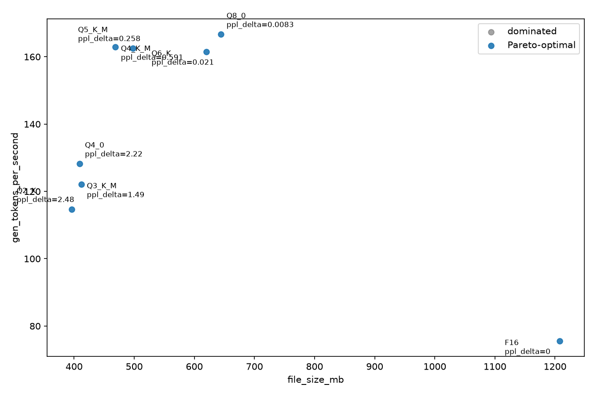

# Benchmark: Qwen2.5-0.5B-Instruct, 8 formats, Apple M4 CPU

A real `llama-bench`/`llama-quantize`/`llama-perplexity` run — not stub
scripts — using quantscope's own CLI end to end: quantize an F16 base into
7 formats, benchmark all 8 (including the F16 baseline) with CPU forced
(`-ngl 0`), measure quality loss relative to F16, and rank the result.



## Setup

| | |
|---|---|
| Hardware | Apple M4, 10 cores, 16GB RAM, macOS 15.7.3 |
| llama.cpp | build `a935fbffe` (version 9960), installed via `brew install llama.cpp` |
| Base model | [Qwen2.5-0.5B-Instruct-GGUF](https://huggingface.co/Qwen/Qwen2.5-0.5B-Instruct-GGUF), `qwen2.5-0.5b-instruct-fp16.gguf` (630,167,424 params, confirmed via `model_n_params` in every row of `results.csv`) |
| Formats | F16 (baseline) + Q8_0, Q6_K, Q5_K_M, Q4_K_M, Q4_0, Q3_K_M, Q2_K, all produced from the F16 base by quantscope's own `quantize` command |
| Perplexity dataset | A real ~150KB prose excerpt from Project Gutenberg's *Pride and Prejudice* (public domain), not synthetic text |
| quantscope | this branch (v0.2.0, pre-tag), built from source |
| Bench config | `--threads 8 --repetitions 3 --n-prompt 256 --n-gen 64`, CPU forced (`-ngl 0` — quantscope always does this now; see the manifest's `n_gpu_layers: 0` despite `gpu_info: "Apple M4"` and `backends: "BLAS,MTL"` both being present) |

Reproduce with:

```bash
cd projects/quantscope
uv sync

MODEL=qwen2.5-0.5b-instruct-fp16.gguf   # download from the HF repo above
uv run quantscope quantize --llama-quantize-bin llama-quantize \
  --input "$MODEL" --output-dir quants Q2_K Q3_K_M Q4_0 Q4_K_M Q5_K_M Q6_K Q8_0

uv run quantscope bench --llama-bench-bin llama-bench \
  --llama-perplexity-bin llama-perplexity \
  --perplexity-dataset wiki-like-sample.txt \
  --perplexity-baseline-format F16 \
  --gguf F16="$MODEL" \
  --gguf Q8_0=quants/qwen2.5-0.5b-instruct-fp16-Q8_0.gguf \
  --gguf Q6_K=quants/qwen2.5-0.5b-instruct-fp16-Q6_K.gguf \
  --gguf Q5_K_M=quants/qwen2.5-0.5b-instruct-fp16-Q5_K_M.gguf \
  --gguf Q4_K_M=quants/qwen2.5-0.5b-instruct-fp16-Q4_K_M.gguf \
  --gguf Q4_0=quants/qwen2.5-0.5b-instruct-fp16-Q4_0.gguf \
  --gguf Q3_K_M=quants/qwen2.5-0.5b-instruct-fp16-Q3_K_M.gguf \
  --gguf Q2_K=quants/qwen2.5-0.5b-instruct-fp16-Q2_K.gguf \
  --threads 8 --repetitions 3 --n-prompt 256 --n-gen 64 \
  --output results.csv --plot frontier.png
```

## What the data shows

| Format | Size (MB) | Gen tok/s | PPL | PPL delta vs. F16 | Pareto-optimal |
|---|---|---|---|---|---|
| F16 (baseline) | 1207.8 | 75.5 | 20.049 | +0.000 | yes |
| Q8_0 | 644.4 | **166.7** | 20.057 | +0.008 | yes |
| Q6_K | 620.2 | 161.5 | 20.070 | +0.021 | yes |
| Q5_K_M | 498.0 | 162.5 | 20.307 | +0.258 | yes |
| Q4_K_M | 468.6 | 162.9 | 20.640 | +0.591 | yes |
| Q3_K_M | 412.0 | 122.1 | 21.540 | +1.492 | yes |
| Q4_0 | 408.9 | 128.2 | 22.270 | +2.221 | yes |
| Q2_K | **395.9** | 114.7 | 22.529 | +2.480 | yes |

**The headline finding, and it's exactly this program's own thesis: Q8_0 is
the *fastest* format tested — faster than Q4_K_M, Q5_K_M, and Q6_K, despite
being nominally "less compressed" than all three.** A naive bits-per-weight
model predicts Q4_K_M (4.8 bpw) should beat Q8_0 (8.5 bpw) on speed; measured
on this exact hardware, it's the reverse: Q8_0 hits 166.7 tok/s against
Q4_K_M's 162.9. This is quantscope's `estimate-size` vs. `bench` distinction
made concrete, not hypothetical — this is a real place the `estimate-size`
heuristic would have given the wrong answer, and only measuring caught it.

All 8 formats land on the Pareto frontier simultaneously — every format that
gets smaller also gets either slower or measurably worse in perplexity, so
none is strictly dominated by another. This is exactly the "which one should
I actually pick?" gap `recommend` exists to close — it narrows the field to
what actually satisfies your constraints (sorted fastest-first, so the top
row is the pick):

```
$ quantscope recommend --csv results.csv --max-ppl-delta 0.3
format  file_size_mb  gen_tokens_per_second  ppl_delta
  Q8_0        644.4                  166.7     0.008   <- pick
Q5_K_M        498.0                  162.5     0.258
  Q6_K        620.2                  161.5     0.021
   F16       1207.8                   75.5     0.000
```

```
$ quantscope recommend --csv results.csv --max-size-gb 0.5
format  file_size_mb  gen_tokens_per_second  ppl_delta
Q4_K_M        468.6                  162.9     0.591   <- pick
Q5_K_M        498.0                  162.5     0.258
  Q4_0        408.9                  128.2     2.221
Q3_K_M        412.0                  122.1     1.491
  Q2_K        395.9                  114.7     2.480
```

Down from "here are 8 Pareto-optimal points, good luck" to "here are your
candidates given what you actually care about, ranked" — a real narrowing
even when it isn't down to exactly one row.

## Known limitations of this specific run

- **Repetitions (3) and dataset size (~150KB) are smaller than a rigorous
  benchmark would use.** `gen_tokens_per_second_stddev` in `results.csv` is
  reasonably tight (0.7 to 8.1 tok/s across all 8 formats), but
  `prompt_tokens_per_second_stddev` is not — Q4_0's is 147.1 against its own
  mean of 923.8 (~16%), notably higher than the other formats' 3-35 range.
  More repetitions would narrow this. Treat this run as demonstrating real,
  qualitatively correct behavior (the Q8_0 finding, the recommend
  workflow), not as a low-variance performance claim for every number in
  the table, particularly prompt-processing speed.
- **One thread count (8), one hardware target, one model size (0.5B).**
  Whether Q8_0 beats the K-quants generalizes to other models/thread
  counts/CPUs is an open question this single run doesn't answer.
- **Perplexity measured on a modest, non-standard text sample** (a
  Pride-and-Prejudice excerpt, not the standard wikitext-2 test set used in
  most published llama.cpp perplexity numbers). Valid for *this* run's own
  same-model, same-tokenizer relative comparison (exactly what ppl_delta is
  for), not for comparing these absolute PPL numbers against numbers
  published elsewhere.
- **No IQ*-format / imatrix-calibrated run included** — `quantize --imatrix`
  is implemented and tested (see `../../ROADMAP.md`) but wasn't exercised
  in this particular benchmark, which only covers the legacy/K-quant
  families.
